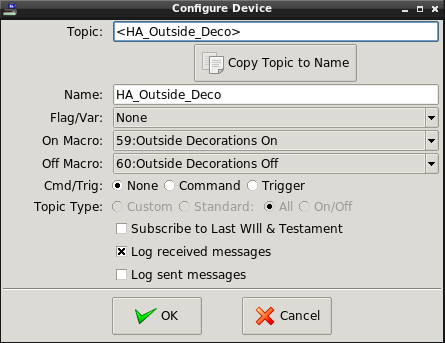
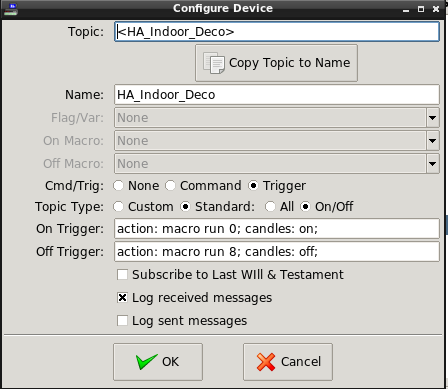
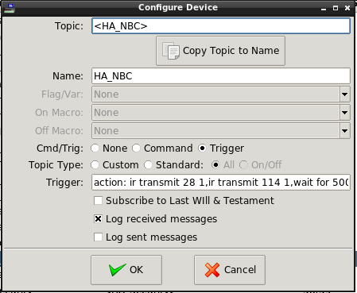

# Tips for Interfacing HomeVision with Home Assistant
{:.no_toc}

<!-- $Revision: 1.9 $ -->
<!-- $Date: 2021/12/23 01:21:51 $ -->

[Back to Projects Index](/index)

[Back to MQTT Index](/MQTT/MQTT_index)

* Overview
  * Basics of the HomeVisionXL MQTT plug-in
    * How the MQTT plug-in Handles Internal Objects
    * How the MQTT plug-in Handles External Devices
  * MQTT Auto Discovery
  * Tips
    * Variable Options
    * Running Macros
    * Running Macros, Setting Flags and Variables and Executing Other Actions
    * Running Scheduled and Periodic Events
    * Running Other Objects
    * Timers
    * Refreshing HomeVision Objects
    * Retain Option for Objects
{:toc}

# Overview
This help discusses ways to connect Home Assistant to your HomeVision controller running HomeVisionXL.
Emphasis is on using MQTT as the connecting method and assumes you have an MQTT broker running in your system.
With the versatility of the MQTT plug-in with respect to how many different ways you can use it to control your devices along with the complexity and power of Home Assistant, the possible combinations are almost endless.
This document tries to give a few of the more obvious solutions to common situations.

## Basics of the HomeVisionXL MQTT plug-in
<!--
<h2>Basics of the HomeVisionXL MQTT plug-in</h2>
-->
First let's go over the basics. The MQTT plug-in provides support for monitoring and controlling of both HomeVision "internal" objects like x10, lights, vars, flags, etc. via MQTT, and "External" devices such as ESP8266 based products running
<!--
<a href="https://tasmota.github.io/docs/">Tasmota</a>
-->
[Tasmota](https://tasmota.github.io/docs/)
software.
This Help doesn't go into all the details of the MQTT plug-in. See
[MQTT Help](/MQTT/MQTT_Client_Plug-in)
<!--
<a href="index.html">MQTT Help</a>
-->
for that.
### How the MQTT plug-in Handles Internal Objects
<!--
<h3>How the MQTT plug-in Handles Internal Objects</h3>
-->
The MQTT plug-in exposes internal objects to the MQTT system by <i>publishing</i> STATE topics to report an object's state and by <i>subscribing</i> to COMMAND topics that can control the internal object. Only internal objects included in the MQTT plug-in's "Int Objects" configuration screen are exposed.

When an exposed internal object changes state, it typically produces one or two MQTT messages, depending on options chosen in "Settings":

<pre>
    stat/topic/POWER ON
</pre> 

and/or

<pre>
    stat/topic/RESULT {"POWER":"ON","Dimming":"100}
</pre>

An internal object can be controlled by sending an MQTT message like this:

<pre>
    cmnd/topic/POWER ON 50
</pre>

### How the MQTT plug-in Handles External Devices
<!--
<h3>How the MQTT plug-in Handles External Devices</h3>
-->
The MQTT plug-in can track the state of and control external devices by <i>subscribing</i> to STATE topics and <i>publishing</i> command messages. Only external devices included in the MQTT plug-in's "Ext Devices" configuration screen are monitored.

When an external device changes state, it typically produces one or two MQTT messages, depending on device settings:

<pre>
    stat/topic/POWER ON
</pre> 

or

<pre>
    stat/topic/RESULT {"POWER":"ON","Dimming":"100}
</pre>

The MQTT plug-in can respond to these STATE messages in a number of ways, such as changing flags or variables, running macros, executing procedures, or any combination of these. 
<br>
<br>
An external device can be controlled by sending an MQTT message like this:

<pre>
    cmnd/topic/POWER ON 50
</pre>

It's important to keep in mind that the above are examples, and there is significant variation in how all this is done, which can be taken advantage of when interfacing with Home Assistant. For Home Assistant, this means that **virtual** external devices can be created and used to cause actions in HomeVision.
## MQTT Auto Discovery
<!--
<h2>MQTT Auto Discovery</h2>
-->
For systems where you want to expose a significant number of internal objects to Home Assistant, the MQTT plug-in provides an Auto Discovery feature that pushes discovery messages to Home Assistant, negating the need to enter each object's code into your <i>configuration.yaml</i>.
<br>
<br>
Valid object types are x10, light, var, flag, flag_b input, output, analog, temp, ir, macro, se, pe, timer and hvac.
Other plug-ins that support objects that can be discovered can add object types.
<br>
<br>
Due to the complexities of proper handling of variables, they are included in discovery as sensors (read-only). More complex variable handling must be done manually. See <a href="#variable-options">Variable Options</a> in the <a href="#tips">Tips</a> section for more information.
<br>
<br>
You can find out more about how to run Discovery here:
[How to Use the MQTT Plug-in's Home Assistant Auto Discovery.](HomeVision_Discovery_How-to)
<!--
<a href="HomeVision Discovery How-to.html">How to Use the MQTT Plug-in's Home Assistant Auto Discovery.</a>
-->
## Tips
<!--
<h2 id="tips">Tips</h2>
-->
### Variable Options
<!--
<h3 id="variable-options">Variable Options</h3>
-->
Straightforward, bi-directional control of variables from the Home Assistant UI is not supported via MQTT Discovery.
For applications other than sensors, it is possible to include HomeVision variables as part of automations, so application-specific configurations could be done.
<br>
<br>
For a simple application of a variable, 
create a slider that takes its value from a State message from HomeVisionXL and transmits back a new value if the slider is manually changed.
This can be done by creating an "input number" entity (to create the slider) along with two automations. 
<br>
<br>
The easiest way to create the input_number entity in Home Assistant is Configuration->Helpers->Add Helper->Number.
<br>
<br>
There are blueprints for the two automations. You can get them into Home Assistant by Configuration->Blueprints->Import Blueprints and use the following URIs:
<br>
<br>
<a href="http://github.com/rebel7580/Home-Assistant/blob/master/get_variable.yaml">https://github.com/rebel7580/Home-Assistant/blob/master/get_variable.yaml</a>
<br>
<a href="http://github.com/rebel7580/Home-Assistant/blob/master/set_variable.yaml">https://github.com/rebel7580/Home-Assistant/blob/master/set_variable.yaml</a>
<br>
<br>
For each variable you want to expose in Home Assistant:

* First create the input_number entity for the variable you want to set/read.
* Create an automation from the "Get Variable" blueprint to read the value of the HomeVision variable.
* Create an automation from the "Set Variable" blueprint to set the value of the HomeVision variable.


You do not need to create both automations if you only want to either just read or just set the variable.
<br>
<br>
If you wish to enter directly in YAML, here is an example.
You will need to replicate these three sets of code for each variable you want to support, making sure you change the Var names and topics.

``` yaml
# Example configuration.yaml entry using 'input_number' in an action in an automation
input_number:
  var_145:
    name: Var 145 Slider
    min: 1
    max: 255
    step: 1
    unit_of_measurement: step
```

The automations should be in <i>automation.yaml</i> or after the <code>automation: !include automations.yaml</code> line in <i>configuration.yaml</i>.

``` yaml
# This automation script runs when a value is received via MQTT
# It sets the value slider on the GUI. Note: the next line may be different if this automation is contained in <i>automation.yaml</i> instead of <i>configuration.yaml</i>.
automation myvars:
  - alias: Set var 145
    trigger:
      platform: mqtt
      topic: 'stat/Var145/RESULT'
    action:
      service: input_number.set_value
      data:
        entity_id: input_number.var_145
        value: "{{ trigger.payload_json.STATE }}"

# This second automation script runs when the slider is moved.
# It publishes its value to the same MQTT topic as myvars.
  - alias: slider moved
    trigger:
      platform: state
      entity_id: input_number.var_145
    action:
      service: mqtt.publish
      data:
        topic: 'cmnd/Var145/POWER'
        payload: "{{ states('input_number.var_145') | int }}"

```

### Running Macros
<!--
<h3>Running Macros</h3>
-->
Macros can be run directly by configuring them in the "Int Objects" screen and running MQTT Discovery.
A simple button or switch in Home Assistant can be configured to use the corresponding macro switch entity.
This is the easiest way to run a macro.
<br>
<br>
What if you want a button that runs a macro, but also shows the result of that action?
You can't do it directly via the macro, since it doesn't report a useful state (as macros have none).
You need another entity  for that.
<br>
<br>
For example, you have a macro ("Toggle Garage Door 1") that toggles your garage door, and an input ("Door1") that indicates the state (Open/Closed) of the door.
You'd like the state/icon of the button to show the door's state.

There are (at least) two ways to do this.
The first is probably the best way, as it does not require manual modification of the <i>configuration.yaml</i> file. The second is the "original" method in these Tips. Both start with this step:
<ul>
<li>Add the "Door1" input and "Toggle Garage Door 1" macro to the "Int Objects" list.
Run MQTT discovery for at least the "Door1" input binary sensor, but it won't hurt if you do for both, so you can use them in Home Assistant for other reasons, as well as in this case.
</li></ul>
<b>Method 1:</b>
<br>
 * Create a button in the HA GUI. Use the GUI editor, but here is the corresponding yaml:

``` yaml
type: button
tap_action:
  action: call-service
  service: mqtt.publish
  service_data:
    topic: cmnd/ToggleGarageDoor1/POWER
    payload: Run
  target: {}
entity: binary_sensor.ib_5_door1
icon: mdi:garage
icon_height: 50px
name: Garage Door 1
```


Done!

If you want "dynamic" icons, leave "icon:" blank, and define a device class for the sensor. See <b>Device Class Note</b> at the end of [How to Use Home Assistant Auto Discovery](/MQTT/HomeVision_Discovery_How-to#device-class-notes)
<br><br>
<b>Method 2:</b>
<br>
 * Manually add the following to your configuration.yaml:

``` yaml
  - platform: mqtt
    unique_id: "MA_GarageDoor1"
    name: "MA_GarageDoor1"
    state_topic: "stat/Door1/POWER"
    command_topic: "cmnd/ToggleGarageDoor1/POWER"
    payload_on: "ON"
    payload_off: "ON"
    state_on: "Open"
    state_off: "Closed"
    qos: 1
```


* Create a button in the HA GUI. Use the GUI editor, but here is the corresponding yaml:

``` yaml
    type: button
    entity: switch.ma_garagedoor1
    icon: 'mdi:garage'
    name: Ron's Garage Door
```


When the button is pressed, the macro will run to toggle the door, and the input will report back the door's position, which will be reflected in the button's state and/or icon.
Since the button's state is controlled by the Door1 state, it can be "On" and "Off".
If "On", the button when press will send the "off" payload,
so both command payloads are set to "ON" since that's what the macro expects.
### Running Macros, Setting Flags and Variables and Executing Other Actions
<!--
<h3>Running Macros, Setting Flags and Variables and Executing Other Actions</h3>
-->
While macros can be run directly by configuring them in the "Int Objects" screen and running MQTT Discovery,
there may be situations where more flexibility is needed.
For example,
you want to run different macros when sending an "on" or "off" from the same topic.
<br>
<br>
The handling of external devices has significant capabilities for executing actions within HomeVisionXL. When a MQTT <i>State</i> message is received by the MQTT plug-in, a number of actions can be done.
We can use these capabilities to enable Home Assistant to do these actions. The way to do this is to create a "virtual" external device, i.e., one defined in the "Ext Devices" MQTT configuration screen, but does not actually physically exist. Instead, we will program Home Assistant to be that "device".
<br>
<br>
<b><i>Example to run different macros when "on" and when "off". Useful for a Home Assistant UI switch.</i></b>
<br>
<br>
First, in MQTT Configuration Ext Devices, set up an virtual external device with an appropriate descriptive topic and the ON and Off macros you want to run defined in the On and Off macro fields.
<br>
<br>
<p align="center">

<!-- 

-->  
</p>
<br>
<br>
Next set up a switch in Home Assistant's <i>configuration.yaml</i> (Since this is an external device, you can't use MQTT discovery):

``` yaml
- switch:
  - platform: mqtt
    unique_id: "HA_Outside_Deco"
    name: "HA_Outside_Deco"
    state_topic: "stat/HA_Outside_Deco/POWER"
    command_topic: "stat/HA_Outside_Deco/POWER"
    payload_on: "ON 1"
    payload_off: "OFF"
    state_on: "ON 1"
    state_off: "OFF"
    qos: 1
```

Note that <i>command_topic</i> and the <i>state_topic</i> are the same. Since HomeVisionXL responds to state messages to execute actions, Home Assistant must send a "stat" message to the MQTT plug-in. Home Assistant also will listen to the <i>state_topic</i>, so will hear its own message an assure that the switch is in the correct state.

Lastly, add in a switch to your UI.

Using the same basic switch design as above, here are two other ways to do things in HomeVisionXL.
<br>
<br>
<b><i>Using triggers for different on/off complex actions:</i></b>
<br>
<br>
This one shows how to use standard ON/OFF triggers to execute actions more complex than just one macro each for ON and OFF. It uses a serial command to the <i>action plug-in</i> to run the macros, then a serial command to <i>custom plug-in</i> to control a candles object.
<br>
<br>
<p align="center">
  
<!-- 
  
-->
</p>
<br>
<br>
<b><i>Using a single trigger for complex actions:</i></b>
<br>
<br>
This one shows using a single trigger (independent of ON/OFF) to send a series of IR commands. 
<br>
<br>
<p align="center">

<!-- 

-->
</p>
<br>
<br>
The compete trigger command (obscured in the screen shot) is:
<pre>
    action: ir transmit 28 1,ir transmit 114 1,wait for 500,
            ir transmit 116 1,wait for 500,ir transmit 110 1;
</pre>
In this example, IR is used, but with a virtual external device to allow for more complex command execution. Consequently, a switch should be added manually to your <i>configuration.yaml</i>. Here is what the switch code would look like:


``` yaml
switch:
  - platform: mqtt
    unique_id: IR_HA_NBC
    name: "IR_HA_NBC"
    state_topic: "stat/HA_NBC/POWER"
    command_topic: "stat/HA_NBC/POWER"
    payload_on: "ON 1"
    payload_off: "Off 1"
    state_on: "ON"
    state_off: "Unknown"
    qos: 1
```


### Running Scheduled and Periodic Events
<!--
<h3>Running Scheduled and Periodic Events</h3>
-->
The MQTT plug-in provides for direct execution of Scheduled and Periodic Events, similar to Macros, by defining them in "Int Objects" configuration.
<br>
<br>
You also can execute a Scheduled Event or Periodic Event by using the trigger option in a virtual external device.
It may be useful to run these after being triggered by some Home Assistant event, in addition to what HomeVision's schedule is doing.
They also can be used simply as additional macro space, <i>especially if put in the "Disabled" state</i>, where they normally won't run via a schedule or period.
<br>
<br>
To do this, in a virtual external device's "Configure Device" screen, select "Trigger" and set the "Trigger:" field to something like this:

<pre>
    action: se run 3;
</pre>

which will run Scheduled Event #3.
### Running Other Objects
<!--
<h3>Running Other Objects</h3>
-->
The previous Tip was called out specifically because it can be used to add in macro capability for those who have run out of macro space.
However the idea can be extended to virtually all items in HomeVisionXL. Since the trigger simply sends whatever is there to HomeVisionXL's serial command processor, you can set triggers for anything the Action plug-in can do (or any other plug-in with its own defined serial commands), and, along with the trigger's capability to make run-time substitutions in a trigger string, Home Assistant may be able to trigger different things based on the payload sent.
In an extreme case, the trigger could be just "%M", in which case Home Assistant would put in the payload the complete trigger string to execute. See
[Triggers](/MQTT/MQTT_Client_Plug-in#triggers) in [MQTT Help](/MQTT/MQTT_Client_Plug-in)
for more details.
### Timers
<!--
<h3>Timers</h3>
-->
HomeVision timers can be controlled via MQTT.
There is no simple "MQTT Discovery" defined in Home Assistant that is appropriate for Timers,
so the MQTT Plug-in's Discovery sets up two "sensor" entities,
one for the timer's state (Running, Stopped, Ringing)
and one for the current time (See Note below).
Time is reported in "HHH:MM:SS.hh" format.
<br>
<br>
The text "state" is appended to the name of the timer for the state entity,
and "time" is appended to the name of the timer for the time entity.
These allow tracking of Timer state and current time, but must be triggered by an MQTT stat message.
<br>
<br>
A Demonstration on how to implement a Timer GUI is as follows.
<ul>
<li>Run MQTT Discovery for the desired timer. This creates two sensor entities. Use these in the GUI to show the Timer state and "current" timer value.</li>
<li>Create the input_select helper for the timer's control states.
(Configuration->Helpers->Add Helper->Select).
This is used to specify what timer command to send.
Use the following values:
<pre>
    Options:
        Load
        Start
        Stop
        Clear
</pre>

</li>
<li>Create the input_text helper for the timer's set time. (Configuration->Helpers->Add Helper->Text).
This is used to specify what timer value to send.
Use the following values:
<pre>
    Max: 12
    Min: 10
    Regex pattern: ^(?:(?:([01]?\\d|2[0-3]):)?([0-5]?\\d):)?([0-5]?\\d\\.)?([0-9][0-9]$
</pre>

</li>
</ul>
Once these are available, 
create a GUI using them.
There are probably many different ways to do this, but here is one.
<br>
<br>
<p align="center">
  
<!--
  
-->
</p>
<br>
<br>
This GUI uses a grid card,
with the two timer entities, the two helpers and two buttons
(to get timer status and send commands to the timer).

Here is the yaml for the above implementation.
This was created using the GUI editor, which is a lot easier than writing in yaml, but is shown here to see the details, especially for the Update payload, which needs to be entered in the payload template in the GUI editor as shown in the yaml.

``` yaml
type: grid
cards:
  - type: entity
    name: Wash Timer State
    entity: sensor.wash_timer_state
  - type: entity
    entity: sensor.wash_timer_time
    name: Wash Timer Status
  - type: entity
    entity: input_select.wash_timer_set
  - type: entity
    entity: input_text.wash_timer_time
    name: Wash Timer Time Set
  - type: button
    tap_action:
      action: call-service
      service: mqtt.publish
      service_data:
        topic: cmnd/WashTimer/POWER
        payload_template: |
          
              load {{ states('input_text.wash_timer_time') }}
          
             {{ states("input_select.wash_timer_set") }}
          
      target: {}
    hold_action:
      action: none
    name: Update Timer
    show_icon: false
  - type: button
    tap_action:
      action: call-service
      service: mqtt.publish
      service_data:
        topic: cmnd/WashTimer/POWER
        payload: '?'
      target: {}
    hold_action:
      action: none
    show_icon: false
    name: Get Timer Status
columns: 2
square: false
```


<b>Note:</b> The timer's current time in the GUI does <i>not</i> update automatically, but only when receiving a "stat" update.
"stat" updates occur whenever a timer command (load, start,stop,clear or query - i.e., "?") is sent to the timer.

### Refreshing HomeVision Objects
<!--
<h3>Refreshing HomeVision Objects</h3>
-->
There may be instances (like restarting Home Assistant) where the current status of HomeVision objects is not reflected by Home Assistant. The MQTT plug-in provides a special topic to force all listed objects to report their status: 
<pre>
        Full Topic                        Payload
    cmnd/homevision/<i>object_type</i>/POWER    empty or "?"
or
    cmnd/homevision/POWER                empty or "?"
</pre>

If you have this issue, you may want to consider adding a button to send this message, or create an automation to issue the command at an appropriate time.
### Retain Option for Objects
<!--
<h3>Retain Option for Objects</h3>
-->
You may also want to consider, as a possible alternative to the previous, whether to enable "retain" for objects that are tracked by Home Assistant.
This should allow Home Assistant to automatically pick up status via the MQTT broker's retained messages feature.
"Retain" is an option in the MQTT plug-in's <i>Configure Object</i> screen.
<br>
<br>
<b>DO NOT confuse</b> the above "retain" with the retain attribute in the Home Assistant discovery payload.
The retain in the Home Assistant discovery payload governs the retain setting of messages sent OUT by HomeAssistant, and is valid only for objects defined as switch, light or climate.