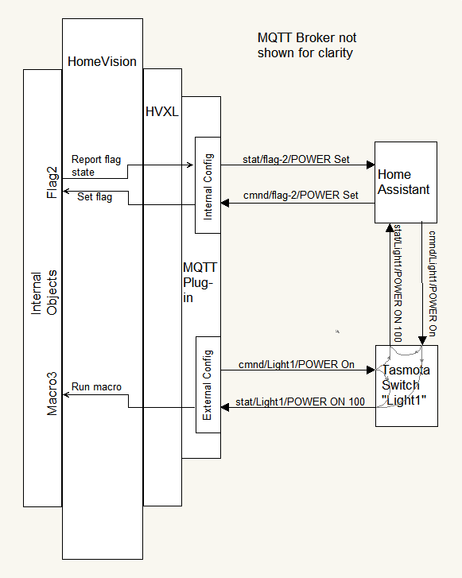

<!-- $Revision: 1.29 $ -->
<!-- $Date: 2021/07/22 21:55:08 $ -->
<!-- <h1 id="mqtt-plug-in-help">MQTT Plug-in Help</h1> -->
# MQTT Plug-in Help
{:.no_toc}

[Back to Projects Index](/index)

[Back to MQTT Index](/MQTT/MQTT_index)

  * Overview
    * Supported MQTT Topics
      * Standard and Custom Topics
      * Standard Command Topic
      * Standard State Topic
      * RESULT State Topic
      * Last Will and Testament Topic
      * Special "homevision" Topic
      * Special Counting Payload
    * Configuring Devices
      * Ext Devices Tab
      * Int Objects Tab
      * Settings Tab
      * Pub/Sub Tab
    * Responding to External Device State Changes
    * Controlling Devices
      * Device/Object Display Area
      * Serial Control
      * NetIO
      * Sending Generic MQTT Messages
      * Custom Processing of Received Messages
        * Custom Commands
        * Triggers
        * Homevision Action Topic
      * mqttComm - Sending/Receiving MQTT Messages from/to Another Plug-in
        * Callbacks with the "sub" form of mqttComm
      * Other Public Procedures Supplied/Called by the MQTT Plug-in
        * <b>topicTemplate</b>
        * <b>mqttLog</b>
        * <b>mqttReady</b>
      * MQTT Discovery for Home Assistant
{:toc}

<!-- <h2 id="overview">Overview</h2> -->
## Overview

The MQTT Client Plug-in provides a client interface to MQTT for HomeVision.
Its main purposes are to control MQTT enabled devices via the HomeVision Schedule or NetIO and
to control HomeVision internal objects (X-10, Flags, etc.) by MQTT sources.

<b>Note: To perform actions on internal objects, this plug-in uses the Actions Plug-in. The Actions Plug-in must be enabled to control internal objects.</b>

While the client plug-in is designed to work easily with
<a href="https://tasmota.github.io/docs/">Tasmota</a> based devices,
using a similar topic structure,
other devices that follow different topic structures likely can be accommodated as well.
There is a lot of flexibility in the plug-in allowing support for many different situations.

The MQTT interface has three distinct functions:
<ul>
<li>For "external" MQTT-enabled devices (e.g., Sonoff switches with Tasmota SW),
the MQTT Plug-in acts as an MQTT controller.
The plug-in PUBLISHES <i>command</i> topics to these devices
to control them
and SUBSCRIBES to <i>status</i> topics from these devices to track their state changes.
Changes are tracked by Actions such as setting Flags or Variables and running Macros based on that status.
</li><li>For "internal" objects defined in HomeVision
(such as X-10 modules, flags, inputs, etc.),
the MQTT Plug-in acts as a "proxy" for them, essentially making them appear to be MQTT-enabled.
For each selected object, the plug-in 
SUBSCRIBES to a <i>command</i> topic
so it can be controlled
and
PUBLISHES a <i>status</i> topic when it changes state.
</li><li>Generic MQTT topics can be sent from the HomeVision schedule via serial commands, from NetIO, or from custom plug-ins, independent of any configured devices.
</li></ul>

The way the MQTT plug-in handles internal objects and external devices can be confusing. In fact, from an MQTT perspective, both internal objects and external devices are handled the same. They are both controlled by command (cmnd) topics and report status via status (stat) topics.

Internal devices are "embedded" in HomeVision. So, from the MQTT perspective, they are controlled (via MQTT) with an incoming cmnd message, and they will report their status via an outgoing stat message.
But that's exactly the same as an external device: control them (via MQTT) with a cmnd message, and they will report their status via a stat message.

<i>A cmnd message is used to control an internal object or external device; a stat message is used to track an internal object's or external device's state.</i>

A confusing part is that the <i>FLOW</i> of cmnd/stat messages with respect to the MQTT plug-in is reversed for the two types, simply because of where they reside in the architecture of the system.

Another confusing part is that for external devices, it may be desirable for Homevision to do something when it reports its status. Hence the plug-in responds to stat status topics. This looks a lot like it is doing a cmnd type of work, but in fact it is no different from any other home automation system. It is just "responding" to the external device's change in status. 

For example, suppose there is an external light switch (like a Tasmotized Sonoff wall switch), and  both HomeVision and Home Assistant. When that switch is turned on, it reports that fact with a stat message, and both systems may respond: HomeVision may take an action, like running a macro, and Home Assistant may show the light is on in the GUI, or even run an automation.

<!-- <h2 id="supported-mqtt-topics">Supported MQTT Topics</h2> -->
## Supported MQTT Topics

<!-- <h3 id="standard-and-custom-topics">Standard and Custom Topics</h3> -->
### Standard and Custom Topics

Topics can be assigned to devices either as abbreviated topics (called "Standard" topics in this help) or full topics.
Standard topics follow the Tasmota structure, so only the unique sub-topic portion need be entered. Default standard topics are indicated by enclosing the sub-topic with "<" and ">".
If a topic starts with a "<", the appropriate prefix is automatically added.
If a topic ends with a ">", the appropriate postfix is automatically added.
A ">" may be followed by optional index digits.
Prefixes and postfixes are defined in the <b>Settings Tab</b>.
Most of the examples to follow assume use of the defaults.
 
 
To provide additional flexibility in defining a system's topic structure, standard topics can have the prefix and postfix indicators in any position relative to the sub-topic.
The following are possible (where "T" is the sub-topic):
<pre>
   Template        Example
      &lt;T&gt;       cmnd/T/POWER   --&gt; Tasmota and MQTT Plug-in default
      T&lt;&gt;       T/cmnd/POWER
      &lt;&gt;T       cmnd/POWER/T
      &gt;T&lt;       POWER/T/cmnd
      T&gt;&lt;       T/POWER/cmnd
      &gt;&lt;T       POWER/cmnd/T

</pre>
To accommodate certain Tasmota devices that have multiple relays or switches, one or more digits can follow the ">" postfix index to specify the relay or switch.
For example, an external device of this type that sends out state reports like this:
<pre>
    stat/FloorLamp/POWER2 ON
</pre>
should be set up with this topic structure:
<pre>
    &lt;FloorLamp&gt;2
</pre>
Devices that send out reports for several "relays" should have separate entries in the <b>Ext Devices Tab</b> for each "relay".
 
 
Note 1:
While Tasmota indices are in the range of "1" through "32",
the plug-in allows any number of digits.
When using one of the templates where the topic follows a postfix with a relay index, care should be taken to avoid topics that start with a number, as the plug-in won't be able to tell where the index ends and the topic begins.
 
 Note 2:
Tasmota considers "POWER1" and "POWER" as the same and interchangeable.
However, the plug-in treats them as different, meaning "POWER" won't match a full topic containing "POWER1".
 
 
If a topic has only a "<" OR a ">", then only the appropriate
prefix OR postfix is automatically added.
Otherwise, the topic is used as-is without any additional portions prepended/appended to it.
Thus by not putting "<" and ">" in a topic,
any topic structure can be used.
However, the plug-in does not have built-in processing when receiving MQTT topics that don't follow the standard prefixes and postfixes. In these cases custom procedures need to be provided. See <b>Custom Processing of Received Messages</b>.
 
 
Most of the examples in the rest of this Help follow the Tasmota standard.

<!-- <h3 id="standard-command-topics">Standard Command Topics</h3> -->
### Standard Command Topic

The following command topic is supported (using default prefixes and postfixes) with various payloads:
<pre>
        Full Topic     Payload
    cmnd/<i>topic</i>/POWER  ON
    cmnd/<i>topic</i>/POWER  ON <i>level</i>
    cmnd/<i>topic</i>/POWER  <i>level</i>
    cmnd/<i>topic</i>/POWER  OFF
    cmnd/<i>topic</i>/POWER  TOGGLE
    cmnd/<i>topic</i>/POWER  empty or "?"** 
</pre>
<i>topic</i> is defined during device configuration.
 Payloads are case-insensitive for incoming messages. 
<i>level</i> is expressed as a percentage, 0-100.
For X-10 devices, it is converted to the <i>next lower</i> discrete level supported.
Any status message will report back the discrete level as a whole percentage, so it may not match exactly what was received.
 
** "?" for those external entities that don't allow an empty payload.
 
 
The plug-in <i>publishes</i> command topics to external devices.
Usually, after receiving one of these commands, an external device will publish its state.
The plug-in receives this report by <i>subscribing</i> to the state topic. (See next.)
A command with an empty payload requests the device to publish its state without changing the state of the device.
 
 
HomeVision objects <i>subscribe</i> to command topics so that external entities can control them.
For a full list of Actions based on the received topic and payload, see 
<a href="MQTT_Actions_int.html">Object Actions.</a>

<!-- <h3 id="standard-state-topics">Standard State Topics</h3> -->
### Standard State Topic
For each external device, the plug-in <i>subscribes</i> to the following topic (assuming &lt;<i>topic</i>&gt; in the "Topic" field):
<pre>
        Full Topic                     Payload
    stat/<i>topic</i>/POWER<i>x</i>           OFF/ON/ON <i>level</i>/<i>level</i>
</pre>
When a POWER topic is received, the plug-in looks for a message of "on" or "off" and takes action according to the device's settings in the <b>Ext Devices Tab</b>.
For a full list of Actions based on the received topic and payload, see
<a href="MQTT_Actions_ext.html">External Device Actions.</a> 
 
 
When an internal object changes state, the plug-in will <i>publish</i> a state message to indicate the object's new state.
<!-- <h3 id="result-state-topic">RESULT State Topic</h3> -->
### RESULT State Topic
Certain devices, i.e., those running Tasmota software, usually produce both at POWER state message and a RESULT state message with the POWER info in a JSON formatted payload.
In fact, RESULT state messages can be sent from the device when many other actions occur.
 
 
To receive such messages, they must explicitly be entered as a device in the <b>Ext Devices Tab</b> with a <i>custom command</i> defined to process the message.
<pre>
          Topic                         Payload
    stat/<i>topic</i>/RESULT               a JSON string
</pre>
<!-- <h3 id="last-will-and-testament-topic">Last Will and Testament Topic</h3> -->
### Last Will and Testament Topic
For each external device with a <i>standard topic</i>
that has "Subscribe to Last Will and Testament" checked,
the plug-in automatically <i>subscribes</i> to
a <i>Last Will and Testament</i> topic as follows:
<pre>
        Full Topic     
      tele/<i>topic</i>/LWT
</pre>
If received, the plug-in looks for a message of "online" or "offline" and attempt to display this message in the <b>Ext Devices Tab</b>.
 
 
In fact, for standard topics, the exact LWT subscription will be as defined in the device's "topic" field, where "tele" is the prefix (&lt;) and "LWT" is the postfix (&gt;).
 
 
If the topic is not in the form of a standard topic,
the "Subscribe to Last Will and Testament" checkbox has no effect.
 
 
LWT is not supported for internal objects.
<!-- <h3 id="special-homevision-Topic">Special "homevision" Topic</h3> -->
### Special "homevision" Topic
The MQTT Plug-in automatically subscribes to:
<pre>
        Full Topic
    cmnd/homevision/#
</pre>
When a message is received in the form:
<pre>
        Full Topic                           Payload
    cmnd/homevision/<i>object_type</i>/POWER      empty or "?"
    cmnd/homevision/POWER                  empty or "?"
</pre>

for each defined object matching <i>object_type</i>
(one of
x10, light, var, flag, hvac, temp, analog, timer, input or output)
or for all of these object types if not specified, the plug-in will <i>publish</i> a state message for each object to indicate its current state.
<i>Only those objects specified in the <b>Int Objects Tab</b> are reported</i>.
Macros, Scheduled Events, Periodic Events and IR are never reported as they have no "state".
This feature can be used by an MQTT entity to quickly sync up with HomeVision object states.
 
 
When a message is received in the form:
<pre>
        Full Topic                           Payload
    cmnd/homevision/action                trigger string
</pre>
the MQTT Plug-in will execute the trigger string.
See <a href="#homevision-action-topic">Homevision Action Topic</a> for details.

<!-- <h3 id="special-counting-Topic">Special Counting Topic</h3> -->
### Special Counting Payload
The MQTT Plug-in has special handling to provide a "counting" feature.
Certain MQTT messages will <i>increment</i> selected variable(s) each time the message is received. To activate this feature,
create either an external device or internal object with either one or two variables selected.
Then, in the "Count Payload Text" of the <b>Settings Tab</b>, enter the text that will indicate "Count".
For external devices, receiving a "stat" or "tele" "POWER" message that has its first word in the payload matching "Count Payload Text" will cause the selected variable(s) to increment.
For internal objects, a "cmnd" "Power" message will do the same.
 
 
For example, if "Count Payload Text" is set to "CYCLE", and an internal object is created with Var-100 and Var-101 assigned to it but re-named "Watchdog",
then when the following is received:
<pre>
    cmnd/Watchdog/POWER CYCLE
</pre>
Var-100 and Var-101 are incremented.
 
 
Note: Other messages that would set variables assigned to this topic will continue to do so.
This can be used to advantage; sending a "cmnd" "POWER" message with a payload of "0" would "reset" the variables so subsequent "Count" messages would start from zero.
<!-- <h2 id="configuring-devices">Configuring Devices</h2> -->
## Configuring Devices

<!-- <h3 id="ext-devices-tab">Ext Devices Tab</h3> -->
### Ext Devices Tab
This tab contains a list of supported external devices.
<i>Device Name</i> is the name of the device for use by serial and NetIO commands.
It must be unique among both external and internal device names.
See below for Name rules.
<i>Topic</i> is the topic used for publishing and subscribing.
See below for Topic rules.
<ul><li>The <i>Flag/Var</i> column shows the Flag (FL-#) or Variable (VA-#) assigned to the device.
If none is assigned, a "-" will show.
</li><li>The <i>Macro</i> column shows the Macro(s) assigned to the device in the form {on macro#}/{off macro#}.
If no macro is assigned, a "-" will show. 
</li><li>The <i>State</i> column will usually show "On" or "Off", depending on the reported state of the device.
If the payload was a number, its value, potentially masked and/or truncated, will be displayed.
When the state has not (yet) been reported, a "-" will show.
</li><li>For each device, its row will be displayed in RED text if the device is reported as "off line" by an LWT message.
However, if an "on Line" LWT or a POWER state message is received,
the row will display in BLACK text.
</li><li>Rows can be sorted in ascending or descending order by <i>Device Name</i> or <i>Topic</i> by clicking on the column header. 
</li></ul>
<i>New/Edit/Delete External Devices</i>

<ul><li>To enter a new device, click the "New" button, and start with the <i>Topic</i>.
<ul><li>Topics are case-sensitive!
</li><li>A "Standard" topic, for which prefix and postfix substitution is performed (see <b>Settings Tab</b>),
is indicated by enclosing it in "<" and ">"
(or one of the variations mentioned previously).
E.g., "&lt;<i>topic</i>&gt;".
<i>This should be the default method for specifying topics.</i>
To help with this, a new device will have "<>" already inserted in the topic field.
(Delete or modify as needed.)
</li><li>Topics can contain multiple levels, indicated by "/", but should not start or end with a "/".
</li><li>A topic with <i>default</i> processing of received messages should not contain "#" or "+" MQTT wildcards, since it is used both to subscribe and publish and wildcards are not allowed in published topics.
</li><li>A topic with <i>custom</i> processing of received messages MAY contain "#" or "+" MQTT wildcards, since it will only be subscribed to.
Use of wildcards should adhere to the MQTT standards.
However, care should be taken when using them. It's probably a bad idea to have "#" as a topic, as it will subscribe to EVERYTHING!
</li><li>Device <i>Names</i>, not topics, are used by NetIO and serial commands to publish commands to MQTT devices.
If the topic is simple and descriptive, it can be copied to the <i>Name</i> field.
If the topic is multi-level, <i>Name</i> must be simpler.
<i>Name</i> cannot contain "<", ">", "/" or spaces.
Alphanumeric and the underscore are the only allowed characters.
<i>Name</i> cannot be "pub", "sub" or "unsub"; these are reserved keywords for sending generic MQTT messages.
</li><li>There is some validation of the <i>Topic</i> and <i>Name</i> fields to enforce the above rules and to avoid name duplication, but it may not be perfect.
</li><li>For each device, an HV Flag or Variable can be assigned. 
Assigning a Flag or Variable is optional.
There is no checking to make sure a Flag or Variable is not used more than once.
<ul><li>If a variable is selected, two additional options are available.
<ul><li>"Use Variable as Flag" treats the variable as a flag with its value being either a "0" (off) or "1" (on). If a value is received instead of "on" or "off", if it is "odd" it represents "on" and if "even" it represents "off". The variable will be set  to "0" or "1" accordingly.
</li><li>If "Use Variable as Flag" is NOT selected, then "Use Two Variables"
can be selected.
If it is, any value received in a stat message will be written to two variables as a 2-byte number. I.e., the LSB will be written to the specified Variable, and the MSB written to the specified Variable + 1.
If the option is not selected, the received value is written as a 1-byte number to the specified Variable.
 
 
Note: When "Use Variable as Flag" is not selected, Payloads with "on" or "off" do not cause any Actions, except for updating the "State" display.
</li></ul>
</li></ul>
</li><li>Macros can be assigned for "On" and "Off" states.
The same macro can be assigned to both states, or different macros can be assigned.
A macro can be assigned to just one of the states, leaving the other set to "None".
</li><li>To have custom processing of received messages or triggers for this topic, select the appropriate mode and enter command/triggers.
See <b>Custom Processing of Received Messages</b> for details.
</li><li>Check "Subscribe to Last Will and Testament" to subscribe standard topics to LWT.
If the topic is not in the form of a standard topic,
this selection has no effect.
</li><li>Choose whether to log MQTT messages sent or received by this device.
</li><li>Click "OK" to save edits, or "Cancel" to discard them.
</li></ul>
</li><li>Devices can be edited by clicking the "Edit" button.
This brings up the same window used for adding a new device.
</li><li>Use the "Delete" button to delete a device.
When a device is deleted, the plug-in unsubscribes to any topics related to that device.
</li><li>When "Done" is clicked, devices with standard topics are subscribed to their state and LWT full topics.
Devices with custom topics are subscribed only to the topic as-is.
<i>Click "Done" for changes to become effective!</i>
</li></ul>
<!-- <h3 id="int-objects-tab">Int Objects Tab</h3> -->
### Int Objects Tab
This tab contains a list of supported internal objects.
These can be any of: X-10, Custom Lights, Flags, Variables, Inputs, Outputs, IR, Digital Temperature Sensors, Analog Inputs, Macros, Scheduled Event, Periodic Events, Timers or HVAC.
Add only those objects that need to be visible to or acted on by the MQTT network.
<ul><li><i>ID</i> is the internal object ID.
X-10 object IDs show with their A-P house/unit code format.
Input and Output object IDs have an "I" or "O" prepended to their usual A-Q codes to distinguish them from X-10 ids.
Other objects show using a "Fake" code of the first two letters of their standard HV object type name. For example, Custom Lights show as "LI".
</li><li><i>Object Name</i> is the name of the object for use by serial and NetIO commands.
It must be unique among both external and internal names. It can be the same as the topic, but cannot contain "<", ">", "/" or spaces.
Alphanumeric and the underscore are the only allowed characters.
<i>Object Name</i> cannot be "pub", "sub" or "unsub"; these are reserved keywords for sending generic MQTT messages.
<b>N.B.:</b> HomeVision allows duplicate names among objects, so some modification to the suggested default names will be necessary to achieve uniqueness in the object lists.
</li><li><i>Topic</i> is the topic used for publishing and subscribing.
Topic rules are the same as external devices with default processing (i.e., no MQTT wildcards).
</li><li>The <i>State</i> column will show the reported state of the object.
The auto reporting feature for objects must be turned on, or the HomeVision schedule must explicitly send updates for this to work.
When the state has not (yet) been reported, a "-" may show.
Variables always show a "-" for the state.
</li><li><i>Level</i> shows the reported object level or value as appropriate.
X-10 and Light objects show their level in percent, while Variables show their value.
</li><li>Rows can be sorted in ascending or descending order by <i>ID</i>, <i>Object Name</i> or <i>Topic</i> by clicking on the column header.
When sorting by ID, object types are always grouped together and then sorted within those groups by ID.
Sorting by <i>Object Name</i> or <i>Topic</i> will sort independant of object type. This is a good way to see potentially related objects; e.g., a switch and a flag that tracks the switch's state (and having similar Names).
</li><li>The "Object Type List Enable" section serves two purposes.
<ul>
<li>Checking object types here limits the Object drop-down list in the Configure New window to make it easier to find the object to configure.
</li><li>
If "Display Only Checked Objects" is selected, the main object list is also limited to checked objects.
 
Checking "Display All" displays all objects independant of the checked object types.
</li></ul>
</li></ul>
<i>New/Edit/Delete Internal Objects</i>

<ul><li>To enter a new object, Click the "New" button and start by selecting an object from the drop-down list.
Objects included in the list are those that have been checked in the
"Object Type List Enable" section of the <b>Int Object Tab</b>.
<ul><li>If a variable is selected, two additional options are available.
<ul><li>"Use Variable as Flag" treats the variable as a flag with its value being either a "0" (off) or "1" (on). If a value is received instead of "on" or "off", if it is "odd" it represents "on" and if "even" it represents "off". The variable will be set  to "0" or "1" accordingly.
</li><li>If "Use Variable as Flag" is NOT selected, then "Use Two Variables" can be selected. If it is, any value received in a stat message will be written to two variables as a 2-byte number. I.e., the LSB will be written to the specified Variable, and the MSB written to the specified Variable + 1. If the option is not selected, the received value is written as a 1-byte number to the specified Variable.
</li></ul>
</li><li>If an X-10 object is selected, then choose a Model.
Model is used to determine how level changes are done.
</li><li>Clicking "Copy Object to Topic, Name" will populate the <i>Topic</i> and <i>Name</i> fields with an appropriate version of the object name.
Some validation is done on the <i>Topic</i> and <i>Name</i> fields; the "OK" button will be grayed out if either field fails validation. 
The <i>Topic</i> and <i>Name</i> fields can be modified, keeping in mind the rules above for topics and object/device names.
 
 
More than one object can have the same topic. This allows a single incoming command to control several objects.
However, note that if a single topic is assigned to multiple objects, when ANY of those objects changes state, the same status message is published so that any external client that might be subscribed to the status message won't be able to tell which object changed state.
 
 
An exception to this is if different index numbers are appended to the topic, in which case each will act and report independently.
</li><li>Choose if object status messages should be sent with the "retained" flag set.
The retain flag will cause most brokers to "remember" the status and send it to any client that later subscribes to the status topic.
</li><li>Choose whether to log MQTT messages sent or received by this device.
</li></ul>
</li><li>Objects can be edited by clicking the "Edit" button. This brings up the same window used for adding a new object.
</li><li>Use the "Delete" button to delete an object. When a object is deleted, the plug-in unsubscribes to any topics related to that device.
</li><li>When "Done" is clicked, objects with standard topics are subscribed to their <b>command</b> full topics. Objects with custom topics are subscribed only to the topic as-is.
<i>Click "Done" for changes to become effective!</i>
</li></ul>
<!-- <h3 id="settings-tab">Settings Tab</h3> -->
### Settings Tab

<ul><li>Prefixes and Postfixes can be set for "standard" topics.
The defaults conform to the Tasmota structure.
They can be changed if necessary, but
avoid Prefixes and Postfixes that have digits at the beginning or end.
</li><li>If desired, enter the "Count" payload text.
Leave blank if not used.
</li><li>"MQTT Broker web/IP Address" defaults to "localhost" which should work if the MQTT broker is on the same (Linux) computer as HomeVisionXL.
If it doesn't work, or the broker and HomeVisionXL are on different computers,
change it to the MQTT broker's domain or explicit IP address.
</li><li>"MQTT Broker Port" defaults to "1883" and probably won't need to change.
</li><li>QOS values for Publish and Subscribe messages can be set for brokers that do not support the defaults of QOS 1 for Publish and QOS 2 for Subscribe.
</li><li>If a username and password is used to log into the broker, check the "Use Username/Password" box and then fill in the username and password.
</li><li>Select the type(s) of state responses desired.
<i>Valid only for internal objects!</i>
 
"Power" enables a standard response like this:
</li></ul>
<pre>
        Full Topic                     Payload
    stat/<i>topic</i>/POWER<i>x</i>           OFF/ON/ON <i>level</i>/<i>level</i>
</pre>

"RESULT" enables a response like this, if "Dimming" is unchecked:

<pre>
        Full Topic                     Payload
    stat/<i>topic</i>/RESULT        {"POWER<i>x</i>":"OFF"/"ON"/"ON <i>level</i>"/<i>level</i>}
</pre>

or like this if "Dimming" is checked:

<pre>
        Full Topic                     Payload
    stat/<i>topic</i>/RESULT        {"POWER<i>x</i>":"OFF"/"ON","Dimmer":<i>level</i>}
</pre>

<ul><li>Note: If set to "Response uses 0-100" (see next item), the POWER value will still be "OFF" if 0 and "ON" if otherwise.
 
One or both of "Power" or "RESULT" <i>must</i> be selected.
If both are <i>unchecked</i>, "Power" will be re-selected automatically.
"Dimming" has no effect if "Power" only is selected.
</li><li>Select the format of device state responses for "stat" MQTT messages.
<i>Valid only for internal objects!</i>
Responses can be either the "OFF"/"ON"/"ON <i>level</i>" format or strictly "<i>level</i>", i.e., 0-100.
Response format can be set separately for appliance modules (which normally would be best set to "OFF/ON") and all others (standard X-10, PCS, Custom Lights, etc.).
</li><li>If logging is desired, check "Create log file".
Doing so will display an entry box for the folder for the logs.
Log files will be created in this folder.
Enter the folder name directly, or click the "..." button to browse to or create it.
To keep file sizes to a reasonable length, a new file is created each day there is logging information.
The file name is "MQTTLogYYMMDD", with an extension determined by "Log File Extension".
If "Log File Extension" is empty, the file will have a ".txt" extension if HomeVisionXL is running in Windows,
and no extension if running in Linux.
<ul><li>Only messages for devices/objects that have their "Log sent messages" or "Log received messages" options checked are logged.
This includes messages sent via the "right-click" menu, serial or NetIO.
</li><li>"Subscribe" and "Unsubscribe" messages are not logged.
</li><li>Received messages to "cmnd/homevision/#" are always logged.
However, responses to this command are determined by the affected objects' settings.
</li></ul>
</li><li>"Netio string", "Serial string prefix string", and "Serial string terminator character(s)" are set to reasonable defaults and probably don't need to be changed, except in the rare case that they conflict with other plug-ins.
</li></ul>

<!-- <h3 id="Pub-Sub Tab">Pub/Sub Tab</h3> -->
### Pub/Sub Tab
The Pub/Sub Tab allows entry and publication of two topic/payload pairs and 
entry and subscription to two topics.
It can be useful for testing or accessing/monitoring other devices.
 
 
Standard or custom topics are allowed.
(See <a href="#standard-and-custom-topics">Standard and Custom Topics</a> for details.)
Subscription topics can make use of MQTT wildcards "#" and "+".
No validation is done on topics.
If a topic is not formed correctly, it simply won't work.
 
 
A payload is not required.
 
 
The "R" checkbox before the "Publish" button sets the retain flag to 1 for the message.
It should rarely be needed. 
The most useful reason for setting retain to 1 (checking the box) would be to clear a retained message in the broker.
Publishing a topic with a empty payload and retain set to 1 should clear any retained messages for that topic in the broker.
 
 
The "E" checkbox before the "Publish" button UTF-8 encodes the payload. This may be necessary if the payload contains "special" characters. (E.g., "°").
It should rarely be needed.
 
 
When receiving a message that matches one of the subscribed topics,
the topic and payload will appear in the Log sub-window (See below) and in the debug plug-in in blue text if the debug plug-in is enabled.
 
 
The "U" checkbox before the "Subscribe" button UTF-8 decodes the payload. This may be necessary if the payload contains "special" characters. (E.g., "°").
It should rarely be needed.
 
 
The "Unsubscribe" button will manually unsubscribe its associated topic.
 
 
Changing and Subscribing a topic entry after the previous entry was Subscribed
will result in the previous entry being automatically unsubscribed before the new one is subscribed.
 
 
When the <i>MQTT Configuration</i> window is closed, subscribed topics remain subscribed.
While obviously not showing up in the Log window, incoming subscribed messages will continue to show in the debug window, if enabled.
 
 
Each text entry field has a drop-down feature to access recent entries:
<ul>
<li>
The drop-down list shows (up to) the 8 most recent entries, in reverse order (newest first).
</li><li>
In the Publish section, Topic and Payload entries are saved into their recent lists once the corresponding "Publish" button is clicked.
In the Subscribe section, Topic entries are saved into their recent lists once the corresponding "Subscribe" or "Unsubscribe" buttons are clicked.
</li><li>
Selecting an entry from the list moves it up to the first position.
</li><li>
Manually typing an entry that is identical to one already in the list behaves the same as selecting that entry (i.e., moves it up to the first position).
</li>
<li>
The recent entry lists are saved when the <i>MQTT Configuration</i> window is closed (clicking "Done"). They can be accessed again if the <i>MQTT Configuration</i> window is subsequently reopened, or the plug-in is disabled then re-enabled.
</li></ul>
<!-- <h4 id="pubsub-log-area">Pub/Sub Log Area</h4> -->
#### Pub/Sub Log Area
The Log window of the Pub/Sub Tab shows results based on publishing and subscribing activity.
<ul>
<li>Each of the four Pub/Sub actions are presented in matching colors in both the Topic entry fields and the Log window.
</li><li>
When a <i>Publish</i> button is pressed, that action is shown in the Log window with either "p1: " or "p2: " prepended to the topic and payload published.
 
When a <i>Subscribe</i> or <i>Unsubscribe</i> button is pressed, that action is shown in the Log window with either "s1: " or "s2: " prepended to the topic subscribed to.
 
When subsequent matching subscribed messages are received, they are shown as they arrive with the appropriate "s1: " or "s2: ".
</li><li>
If "Timestamp?" is checked, a timestamp is prepended according to the "Format".
The default is "%d-%T", which translates to "dd-hh:mm:ss". Other formats are possible using the TCL "clock" formats here: <a href="https://www.tcl.tk/man/tcl8.6/TclCmd/clock.htm#M26">https://www.tcl.tk/man/tcl8.6/TclCmd/clock.htm#M26</a>
</li><li>
The log stores the most recent 250 lines. Use the scroll bar to view.
However, when a new line comes in, the section of the log being displayed may shift so that the most recent entry is visible.
 
If there are new entries coming in fast, it may not be possible to select and copy text before the selection scrolls out of the visible window.
See next item.
</li><li>
Right clicking within the Log window will bring up a menu to "Select All", "Copy" selected lines to clipboard, "Clear" the entire log or "Freeze" or "Unfreeze" the view.
"Freeze view" will stop the view from jumping to the new line so selection and copy or just viewing older entries can be done more easily.
The log will continue to collect any new entries.
</li><li>
A subset of lines can be selected by dragging the cursor through the desired text.
Right clicking then "Copy" will put the selection on the clipboard.
</li><li>
The log will continue to collect new entries while the <i>MQTT Configuration</i> window is open, even if you move to a different tab.
Log information is <i>deleted</i> when the <i>MQTT Configuration</i> is closed (by clicking "Done").
</li></ul>
<!-- <h2 id="responding-to-external-device-state-changes">Responding to External Device State Changes</h2> -->
## Responding to External Device State Changes
Refer to <a href="MQTT_Actions_ext.html">External Device Actions</a> for responses to received messages.
 
 
Note that an assigned Flag or Variable is always updated before the macro is run so the macro can take advantage of the new value.
<!-- <h2 id="controlling-devices">Controlling/Monitoring Objects and Devices</h2> -->
## Controlling/Monitoring Objects and Devices
<!-- <h3 id="deviceobject-display-area">Device/Object Display Area</h3> -->
### Device/Object Display Area
Right-clicking on a line in the Device/Object Display Area
will bring up a menu from which "On", "Off", "Toggle", "State", and "Set to" can be selected.
For internal objects, one or more of these items may be grayed out if not appropriate for the object type.

For external devices, none are grayed out as there is no knowledge of the capabilities of the device. Some or all of these items may not work based on what the device can do (or not do).
 
 
When selected, for standard topics, the corresponding <i>command</i> topic is published. (See <b>Standard Command Topics</b> above).
For other non-standard topics, the right-click items may or may not make sense.
 
 
For external devices, this typically will make its way through the MQTT broker to the external device which would then act on the command.
For external device topics that are not standard, or at least missing the "<", the topic will be published "as-is", with the appropriate payload.
Since the plug-in will have subscribed to this topic, the message will be sent right back to the plug-in from the broker.
 
 
For internal objects, 
the corresponding command topic is published in the same manner as external devices.
(Some object types "interpret" the selection depending on its capability. For example, clicking "On" for a flag translates to SET, while "Off" translates to CLEAR.)
<i>No action is taken directly on the internal object.</i>
Only a cmnd messages is sent out.
However, since the internal object has <i>subscribed</i> to the command topic,
the MQTT broker will send it right back to the plug-in,
which will then set the object to the requested state.
If the command topic causes an object state change, the plug-in completes the sequence by publishing a state topic showing the new state.
Here's a sequence chart example that might make it more clear:
<pre>
  HomeVision            Plug-in                     MQTT Broker

                 Right-click X-10 object "Den"
                     and click "Toggle":

                    cmnd/den/POWER TOGGLE --&gt;
                                          &lt;-- cmnd/den/POWER TOGGLE
               &lt;-- HV cmd to toggle Den
  sends X-10 cmd
   to toggle Den
               --&gt; stat/den/POWER {value} --&gt;
</pre>

<!-- <h3 id="serial-control">Serial Control</h3> -->
### Serial Control
MQTT devices can be controlled within a schedule via serial commands which take one of these forms:
<pre>

    mqtt: {-log|-nolog -retain|-noretain} <i>device_name/object_name</i> <i>command</i>; 
     - <i>command</i> is one of: [0|off|1|on|2|toggle|on {level}|state]. 
         "state" requests status from device/object.
     - Logs and retains according to option(s) if present (overrides configuration settings);
     - Default: log and retain according to named device/object's config settings.

    mqtt: {-log|-nolog -retain|-noretain} pub <i>topic</i> {<i>payload</i> {retain}};
     - logs and retains according to option(s) if present;
     -   "-retain|-noretain" removes "retain as last word" restriction.
         I.e., payload can actually include "retain" as last word;
     - default: always logs and retains if last word is "retain".

    mqtt: {-log} [sub|unsub] topic <<i>topic</i>>|<i>topic</i> <i>callback</i>;
     - logs if option is present, never retains;
     - default: never logs, never retains.

    "mqtt:" is whatever the "Serial string prefix" is defined as.
    ";' is whatever the "Serial string terminator character(s)" is defined as.
</pre>

<!-- <h4 id="device-object">Device/Object Form</h4> -->
#### Device/Object Form
This is the simplest form and can be used for any device or object alredy configured in the <b>Ext Devices</b> or <b>Int Objects</b> tabs.

For example, to toggle a device <i>named</i> "sonoff1", the serial command would be:
<pre>
    mqtt: sonoff1 toggle;
</pre>
X-10 and Custom Lights can be set to a level by using "on <i>level</i>". E.g.,
<pre>
    mqtt: den on 50;
</pre>
The device <i>name</i> is case-insensitive when matching a device <i>name</i> in the Device list.
The <i>command</i> portion is sent as-is, case-wise.
 
 
Note: Device <i>names</i> are limited to alphas, numbers and the underscore.
 Note: While serial commands in the schedule can change the state of internal objects as well as external devices, it may make more sense to just set the internal object directly in the schedule.
In either case, the plug-in will publish a state change topic if the state actually changed.

<!-- <h4 id="generic-form">Generic Form</h4> -->
#### Generic Form
In addition to the external and internal device/object specific MQTT messages,
the plug-in allows generic MQTT messages that may or may not be related to any configured device.
This gives freedom to send anything necessary without tying messages to specific configured devices.
 
 
For "pub" commands, if the last word in the payload is "retain",
the command is sent with the MQTT retain flag set.
However, if either <i>-retain</i> or <i>-noretain</i> is present, it removes the "retain as last word" restriction.
I.e., payload can actually include and send "retain" as the last word.
 
 
Examples:
<pre>
    mqtt: pub "cmnd/living room/POWER" some payload info;
          logs; sends "some payload info" to "cmnd/living room/POWER"; no retain.
    mqtt: -nolog pub "cmnd/living room/POWER" some payload info;
          no log; sends "some payload info" to "cmnd/living room/POWER"; no retain.

    mqtt: pub "cmnd/living room/POWER" some payload info retain;
          logs; sends "some payload info" to "cmnd/living room/POWER"; retains.
    mqtt: -nolog -noretain pub "cmnd/living room/POWER" some payload info retain;
          no log; sends "some payload info retain" to "cmnd/living room/POWER"; no retain.

</pre>

For sub and unsub commands, <i>callback</i> is a public callback procedure that must exist in a plug-in.
 
 
Examples:
<pre>
    mqtt: sub tele/somedevice/state mycb;
    mqtt: unsub tele/somedevice/state mycb;
</pre>

<!-- <h4 id="formatting-rules">Formatting Rules</h4> -->
#### Formatting Rules
<ul>
<li>
If a topic has spaces, the entire topic should be enclosed in double-quotes or braces {}.
</li>
<li>
Double-quotes or braces are NOT necessary for any spaces in the payload portion.
However, if the payload has quotes and/or braces, it should be enclosed in braces.
 
 
Example:
<pre>

    mqtt: pub "cmnd/topic with spaces/result" {{"JSON":"test"}};

</pre>
</li>
<li>
Backslashes in the payload portion should be "escaped" by another backslash (e.g., "\\").
</li>
</ul>

<!-- <h3 id="netio">NetIO</h3> -->
### NetIO
<b><i>
NOTE: While the NetIO application is no longer supported by its developers,
it still works and the NetIO plug-in may still be useful to those still using the app.
</i></b>
 
 
MQTT devices can be controlled via NetIO using a "netioaction" command in the NetIO application.
All forms of the serial commands are available for NetIO as well.
 
 
For example, to have a button set up to toggle a device <i>named</i> "sonoff1",
the button's <i>sends</i> attribute would be set to:
<pre>
    sends: netioaction mqtt sonoff1 toggle
</pre>
"mqtt" is whatever the "Netio string" is defined as.
"toggle" or "2", "on" or "1", "off" or "0", "on {level}" and "state" are allowed.
 
 
The device <i>name</i> is case-insensitive when matching a device <i>name</i> in the Device list.
The <i>command</i> portion is sent as-is, case-wise.
 
 
The state of the device can get retrieved by:
<pre>
    reads: get mqtt sonoff1
</pre>
The <i>get</i> command will return the object's state string, depending on the state of the device.
 
 
Note: This is a "convenience" command, since it actually just reads the state of the Flag or Variable associated with an external device,
or the state of an internal object.
For external devices, if no flag or variable are associated, an empty string is returned.
If the device's state has not yet been reported, the last value of the Flag or Variable will be returned.
 
 
Also note that this command is essentially the same as the more direct gets:
<pre>
    reads:  get var state <i>var#</i>
</pre>
or
<pre>
    reads:  get flag state <i>flag#</i>
</pre>
or
<pre>
    reads:  get x10 state <i>id#</i>
</pre>
except that no NetIO Custom Returns processing is done.
So the direct object gets are probably better to use than the MQTT versions.
 
 
Generic MQTT messages can be sent via NetIO using a "netioaction" command in the NetIO application in a similar way as serial commands.
 
 
Examples:
<pre>
    sends:  netioaction mqtt sub tele/somedevice/state mycb
    sends:  netioaction mqtt unsub tele/somedevice/state mycb
    sends:  netioaction mqtt pub {cmnd/living room/POWER} some payload info
    sends:  netioaction mqtt pub {cmnd/living room/POWER} some payload info retain
</pre>
Note: For NetIO, a topic with spaces must be enclosed by braces {}.
Double-quotes are not allowed due to the way NetIO handles arguments of the netioaction command.

<!-- <h3 id="custom-processing-of-received-messages">Custom Processing of Received Messages</h3> -->
### Custom Processing of Received Messages
Sometimes a topic may not fit the standard forms supported by the plug-in, or the actions taken (setting flags, variables and running macros)
may not be powerful enough.
There are four methods that provide more advanced processing, listed here in increasing independance from the MQTT Plug-in's configuration:
<ul>
<li>Triggers - Send trigger strings, defined in an external device's configuration, to HomeVisionXL and other plug-ins.
</li><li>Custom Commands - Create a plug-in and define a command, referenced in an external device's configuration, to run when a topic is received;
</li><li>Homevision Action Topics - Receive an MQTT command with a payload that contains a trigger string. No external device is needed.
</li><li>Independant Plug-ins - Relies on subscriptions in the plug-in instead of the "Custom Commands" method, where the MQTT Plug-in does the subscribing. Moves ALL activity into a plug-in so no external device is needed.
See "mqttComm" section for details.
</li></ul>
Triggers and Homevision Action Topics are relatively simple to construct.
Custom Commands and Independant Plug-ins require some knowladge of the TCL programming language.
<!-- <h4 id="triggers">Triggers</h4> -->
#### Triggers
Triggers are a way to get a little more processing power without coding.
Works well for sequential actions that don't require decision making.
 
 
Instead of a command procedure, enter serial trigger strings to perform actions. A serial trigger string can be one or more "built-in" HomeVisionXL strings and/or serial strings supported by existing plug-ins.
 
 
Note: Like "Command",
the "Flag/Var", "On Macro" and "Off Macro" fields are ignored.
However, use the action command in trigger(s)
to manipulate flags, vars, macros, etc..
 
 
To use Triggers, select "Trigger". 
Once selected, the "Topic Type" options are available. 
 
 
Selecting "Standard" is used with standard topics
(generally, those of the form &lt;topic&gt;),
so "stat" messages with payloads of "on", "off","on {level}" and "{level}" are available.
If "All" is selected, then only one trigger entry is provided, and this is run regardless of the payload.
If "On/Off" is selected, there are separate entries for the "on" and "off" states. However, one of the two fields can be empty, which means that nothing will happen for messages received with that state.
A payload of "0" or "on 0" implies "off".
 
 
Selecting "Custom" should be used for topics that don't adhere to the "standard" topic model, and hence can't be guaranteed an "on/off" payload.
Only one trigger entry is available and is run regardless of the payload contents.
 
 
The following special character strings will cause substitutions for every occurrence in a trigger string(s).
(Note: %X, %P, %E, %L don't make sense for "Custom" trigger strings, but, if used, will result in a "0" being substituted.)
<ul>
<li><b>%X</b> Substitute a received 0-100 level scaled to 0-16 (standard <b>X</b>10).
</li><li><b>%P</b> Substitute a received 0-100 level scaled to 0-31 (<b>P</b>cs).
</li><li><b>%E</b> Substitute a received 0-100 level scaled to 0-63 (dir<b>E</b>ct to level).
</li><li><b>%L</b> Substitute a received 0-100 <b>L</b>evel unscaled.
</li><li><b>%O</b> Substitute the t<b>O</b>pic.
</li><li><b>%M</b> Substitute the entire payload  (<b>M</b>essage) unmodified.
</li><li><b>%m</b> Substitute the entire payload  (<b>m</b>essage), substituting single quotes for double quotes.
</li><li><b>%D</b> Substitute the current <b>D</b>ate in the form YYYYMMDD.
</li><li><b>%T</b> Substitute the current <b>T</b>ime in the form HH:MM:SS.
</li></ul>
 
Examples:
 
 
Play a sound file and run a program when the topic is received.
This example shows how two separate "built-in" triggers can work together in one trigger string. 
(Assumes that the sound and program functions are working.)
<pre>
Options: Custom. 

Trigger:
    Play wav file "alarm"  Run program "sendtext"
</pre>
 
Write a daily log file. (This may be redundant, as the MQTT Plug-in has logging capability in other forms, but shows what can be done.)
<pre>
Options: Standard, All.
 
Trigger:
    write to file "filename%D" "%T: %O:%M"
</pre>
 
Write a daily log file, where the payload may have double quotes in it (i.e., a JSON string).
In that case, the double quotes must be converted to single quotes to avoid confusing the "write to file" processing.
<pre>
Options: Standard, All.
 
Trigger:
    write to file "filename%D" "%T: %O:%m"
</pre>
 
<i>The following examples require action plug-in version 1.3 or greater.</i>
 
 
Turn on/off other lights to same level as triggering device.
 
<pre>
Options: Standard, On/Off. 

On Trigger:
    action: x10 pcslevel c12 %P, x10 level a3 %X;

Off Trigger:
    action: x10 off c12, x10 off a3;
</pre>
 
Tune a TV to a channel using IR.
(Select cable input to TV, then tune a channel with a .5 second delay between digits.)
 
<pre>
Options: Standard, On/Off. 

On Trigger:
    action: ir transmit 28 1,ir transmit 114 1,wait for 500,ir transmit 116 1;

Off Trigger:
    {empty}
</pre>
 
Tune a TV to a channel on a streaming service.
(Turn on TV, 0.5 second delay for TV to turn on, select streaming device input, then select streaming channel.)
This example shows how two separate plug-in triggers (action and roku) can work together in one trigger string.
 
<pre>
Options: Standard, On/Off. 

On Trigger:
    action: ir transmit 2 1,wait for 500,ir transmit 26 1; roku: 13;

Off Trigger:
    {empty}
</pre>
Note: <i>roku</i> is a custom plug-in. See it
<a href="https://rebel7580.github.io/Roku/Roku_index">Here</a>.
<!-- <h4 id="custom-commands">Custom Commands</h4> -->
#### Custom Commands
To have custom processing of received messages for a topic,
click "Command" and enter a procedure name in the "Command" field.
The procedure becomes the callback procedure for this topic.
 
 
This option requires a procedure to be defined in a custom plug-in.
See <a href="#custom-command-details">Custom Command Details</a> for details.

<!-- <h4 id="homevision-action-topic">Homevision Action Topic</h4> -->
#### Homevision Action Topic
This Topic can be used to send a set of commands just like those allowed in an external device <i>trigger</i>.
Since this method is not supported in Home Assistant's MQTT discovery, it would need to be used in configuration.yaml or in a GUI-based construction, like a button.

<i>However, it is powerful enough that, in some cases, using this method could eliminate the need for "virtual" external devices and the corresponding manual configuration.yaml changes if using Home Assistant!</i>

For example, the previous external device trigger can be done like this:
<pre>
    Topic:    cmnd/homevision/action
    Payload:  action: ir transmit 2 1,wait for 500,ir transmit 26 1; roku: 13;
</pre>
In response to an action command, the actions will be returned in a status message:
<pre>
    Topic:    stat/homevision/action
    Payload:  action: ir transmit 2 1,wait for 500,ir transmit 26 1; roku: 13;
</pre>
This message may be returned before all the actions in the trigger are completed, especially if the trigger contains "waits".

Trigger % substitutions are NOT performed on the payload using this method.

<!-- <h3 id="custom-processing-plug-ins">Custom Processing Using HomeVisionXL plug-ins (For TCL programmers!)</h3> -->
### Custom Processing Using HomeVisionXL plug-ins (For TCL programmers!)
For those who may want to have total control of processing incoming/outgoing MQTT data,
custom plug-ins can be used.

<b>Those not interested in creating their own plug-ins can safely ignore this section.</b>

<!-- <h4 id="custom-command-details">Custom Command Details</h4> -->
#### Custom Command Details
To have custom processing of received messages for a topic,
click "Command" and enter a procedure name in the "Command" field.
The procedure becomes the callback procedure for this topic.
 
 
Note: If "Command" is selected,
the "Flag/Var", "On Macro" and "Off Macro" fields are ignored.
However, the action command can be used in the procedure to manipulate flags, vars, macros, etc..
 
 
Log settings are also ignored. Any logging should be done in the command procedure using the <b>mqttLog</b> command (See below).
 
 
<b>CAUTION: There is little validation of the name of the custom procedure. Care should be taken to avoid any standard TCL procedure names as inadvertently using an existing procedure name may result in abnormal behavior!</b>
 
 
The procedure must be defined in another enabled plug-in, 
and must be made public via the <code>hvPublic</code> command.
A plug-in can contain several different procedures that are called by different messages.
 
 
The procedure will be called like this:
<pre>
    procedure_name <i>topic</i> <i>payload</i> <i>retain</i> <i>{other args}</i>
</pre>
For most procedures, <i>retain</i> can be ignored. <i>{other args}</i> may be present in future versions of the MQTT client
and likely not be important for typical procedures. For those interested, details of <i>retain</i> and any future <i>other args</i> can be found 
<a href="https://chiselapp.com/user/schelte/repository/mqtt/wiki?name=Tcl+MQTT+client">here</a>
 
 
Example:
 
 
Suppose we have a device (named BathHumidity) running Tasmota software with a AM2301 temperature/humidity sensor attached , and we want to turn on a ventilator fan (named BathFan) when the humidity gets high (>70) and turn it off when it is low (<55).
We would get periodic MQTT tele reports like this:
<pre>
    tele/BathHumidity/SENSOR {
        "Time":"2020-05-20T15:13:25",
        "Switch2":"OFF",
        "AM2301": {
              "Temperature": 75.0,
              "Humidity": 82.0
        },
        "TempUnit": "F"
    }
</pre>

(The JSON payload is expanded here for readability.)
 
 
In the <b>Ext Devices Tab</b>, add an external device for the humidity sensor with a full topic of
<pre>
    tele/BathHumidity/SENSOR
</pre>

The MQTT Plug-in will explicitly subscribe to this topic instead of the normal standard state topics.
Click "Command" and set the <i>Command</i> entry field to "humid".
Click "OK" to save this entry.
 
 
Add another external device for the fan with a standard topic
<pre>
    &lt;BathFan&gt;
</pre>
so that it will report status
in the standard way, like this:
<pre>
    stat/BathFan/POWER ON
</pre>
Click "Command" and set the <i>Command</i> entry field to "bathfan".
Click "OK" to save this entry.
 
 
Click "Done" for changes to be effective!
 
 
Create a plug-in containing the following:
<pre>
    tcl::tm::path add [file dirname [info script]]
    package require json 1.0

    hvImport mqttComm
    
    hvPublic humid
    proc humid {topic payload args} {
        global fanStatus
        if {$payload eq ""} return
        if {[catch {::json::json2dict $payload} status]} return

        set humidity [dict get $status AM2301 Humidity]
        if {$humidity > 70 && !$fanStatus} {
            mqttComm pub "cmnd/BathFan/POWER" on
        }
        if {$humidity < 55 && $fanStatus} {
            mqttComm pub "cmnd/BathFan/POWER" off
        }
    }
    
    hvPublic bathfan
    proc bathfan {topic payload args} {
        global fanStatus
        if {[lindex [split $topic "/"] end] eq "POWER"} {
            if {$payload eq "ON"} {
                set fanStatus 1
            } elseif {$payload eq "OFF"} {
                set fanStatus 0
            }
        }
    }
</pre>
(See next Section for a description of <b>mqttComm</b>.)
 
 
Procedure <b>humid</b> is called whenever a humidity status message is received. It processes the JSON status message to get the humidity and turns the fan on or off depending on the humidity level.
Since we only care about the topic and payload, we can lump the rest into <i>args</i> and ignore that.
 
 
Procedure <b>bathfan</b> is called whenever a state message from the fan switch is received. It tracks the state of the fan so <b>humid</b> only turns the fan on/off if it is not already.
In reality, <b>bathfan</b> isn't necessary, as turning on the fan while it is already on does no harm. It's here mainly as an example of how to set up a command.

<!-- <h4 id="mqttcomm---sendingreceiving-mqtt-messages-fromto another-plug-in">mqttComm - Sending/Receiving MQTT Messages from/to Another Plug-in</h4> -->
#### mqttComm - Sending/Receiving MQTT Messages from/to Another Plug-in

When total control for MQTT message processing is needed,
this method takes "Custom Commands" a step farther.
A plug-in can be essentially independent of processing that is done in the MQTT Plug-in, except for using it as a MQTT transport mechanism.
 
 
Other plug-ins can interface with the MQTT Plug-in via the <b>mqttComm</b> command.
The calling plug-in should import the command via:
<pre>
    hvImport mqttComm
</pre>
The <b>mqttComm</b> command has the following formats:
<pre>
    mqttComm {-log} sub|unsub <<i>topic</i>>|<i>topic</i> <i>callback</i> 
    mqttComm {-exactstat -nodim -log -retain -encode} stat|cmnd <<i>topic</i>>|<i>topic</i> {<i>payload</i>}
    mqttComm {-log -retain -encode} pub <i>topic</i> {<i>payload</i>}
</pre>
<ul>
<li>Note: In previous versions (&lt; 1.76), "type", the name of the calling plug-in, was the first argument. This has been deprecated. However, for backward compatibility, new versions of the command will allow (and ignore) a "type" argument.
</li><li>-log: Log the command. This argument is optional.
</li><li>-exactstat: Sends only a POWER stat response regardless of power/result settings. This argument is optional.
</li><li>-nodim: Don't include Dimming in a RESULT response. This argument is optional.
</li><li>-retain: The sent message is retained by the broker. This argument is optional.
</li><li>-encode: The payload is UTF-8 encoded. This may be necessary if the payload contains "special" characters. (E.g., "°"). This argument is optional.
</li><li><i>topic</i>: Can either be enclosed in "<>" (or any of the other standard forms) or not. If a standard form is used, MQTT's standard prefixes and the Power post-fix will be added to create a full topic. Otherwise, a topic with neither "<" nor ">" is used as-is, without adding the standard pre- and post-fixes, essentially creating generic MQTT messages. If the topic contains spaces, the topic along with any "<" or ">", should be enclosed in double-quotes.
</li><li><i>payload</i>: The MQTT message payload to send and is valid only for "cmnd", "stat" and "pub" actions. Double-quotes or braces are NOT necessary for any spaces in the payload portion.
</li><li><i>callback</i>: The name of a procedure in the calling plug-in that will process the subscribed-to incoming message and is valid only for "sub" and "unsub". 
See <i>Callbacks with the "sub" form of <b>mqttComm</b></i> below for more details on callbacks.
</li>
</ul>
 
A "stat" or "cmnd", when used with a topic with neither "<" nor ">", ignores the "stat" or "cmnd" and is the same as using "pub".
 
 
A "pub" or "cmnd", when used with a standard topic, is the same as using "cmnd".
 
 
When the standard form is used with "sub" or "unsub", a "cmnd" pre-fix is assumed.
To subscribe or unsubscribe to a "stat" type topic, use the topic without the "<".
Example: To subscribe to a stat message:
<pre>
    <b>mqttComm</b> sub stat/uroom> cascallback
</pre>
which will subscribe to
<pre>
    stat/uroom/POWER
</pre>
with "cascallback" as the callback procedure.
 
 <b>Caution:</b>
Make sure when subscribing to a topic that the topic is unique, especially compared to <i>external devices</i> and <i>internal objects</i>.
The MQTT client allows multiple, different callback procs to be assigned to the same topic (via different subscriptions) resulting in all of the procs being called when the common topic arrives.
This could be useful, but normally it will cause unexpected behavior.

For the MQTT client to successfully execute the callback procedure,
an "hvPublic" command should be added to the plug-in. For example,
<pre>
    hvPublic cascallback
    proc cascallback {topic payload retain} {
        ...
    }
</pre>
 
 
The <b>mqttComm</b> procedure returns an empty string if MQTT is not ready.
This can be used to trigger retries until MQTT is ready.
 
 
The <b>mqttComm</b> procedure returns 0 if the type, action or topic is missing or NULL,
or if there is no payload for a cmnd or stat command.
 
 
The <b>mqttComm</b> procedure returns 1 for a successful operation.
 
 
Examples:
<pre>
    mqttComm sub &lt;uroom&gt; cascallback
        subscribes to cmnd/uroom/POWER with callback cascallback

    mqttComm unsub stat/uroom/power mycallback
        unsubscribes to stat/uroom/power with callback mycallback

    mqttComm cmnd &lt;uroom&gt; on
        publishes cmnd/uroom/POWER on

    mqttComm stat &lt;uroom&gt; on
        publishes stat/uroom/POWER on and/or
                  stat/uroom/RESULT {"POWER":"ON","Dimming":100}

    mqttComm -nodim stat &lt;uroom&gt; on
        publishes stat/uroom/POWER on and/or
                  stat/uroom/RESULT {"POWER":"ON"}

    mqttComm -exactstat stat &lt;uroom&gt; on
        publishes stat/uroom/POWER on 

    mqttComm stat "cmnd/room 2/state" on
        publishes cmnd/room 2/state on

    mqttComm pub "cmnd/room 2/state" on
        publishes cmnd/room 2/state on
</pre>

<!-- <h5 id="callbacks-with-the-sub-form-of-mqttcomm">Callbacks with the "sub" form of mqttComm</h5> -->
##### Callbacks with the "sub" form of mqttComm

When something subscribes to a topic, the assumption is that some action should be taken when a message with that topic arrives.
So how is that handled when a plug-in uses <b>mqttComm</b> to subscribe to a topic?
This is where callbacks come in.
When an incoming MQTT message arrives, the MQTT Plug-in will call the callback procedure associated with the previous subscription for that topic.
It will be called like this:

<pre>
    <b>callback</b> <i>fulltopic payload retain</i>
</pre>

<ul><li><b>callback</b>: The callback procedure name.
</li><li><i>fulltopic</i>: The complete topic, as received, including any prefix or postfix.
</li><li><i>payload</i>: The message payload.
</li><li>When a new subscription is made by a client, all retained messages that match the full topic are reported with <i>retain</i> set to 1. Any messages matching the full topic that are subsequently received by the broker are reported with a value of 0.
</li></ul>
 
This is best explained by example.
Let's assume a plug-in wants to subscribe to a topic:
<pre>
    mqttComm sub &lt;uroom&gt; cascb
</pre>
This results in a subscription to
<pre>
    cmnd/uroom/POWER
</pre>
When received, this topic means either report back the current device state (with an empty or "?" payload),
or change the device state based on the payload.
That means that when the MQTT Plug-in receives the message, it must communicate with the subscribing plug-in to complete the response.
It does this by calling the callback procedure. Let's say some external entity wants to know the state of uroom.
When the MQTT Plug-in received the appropriate message, it calls the callback procedure like this:
<pre>
    cascb cmnd/uroom/POWER "?" 0
</pre>
A procedure "cascb" must be defined and made public (via <i>hvPublic cascb</i>) in the calling plug-in to handle the message.
In this case, it should eventually use another <b>mqttComm</b> command to send back status, maybe like this:

<pre>
    mqttComm stat &lt;uroom&gt; On 50
        --->   stat/uroom/POWER ON 50
</pre>
There are a couple of different approaches to handling subscribed topics. Which is better depends on the goals of the plug-in.
 
 
If the plug-in is going to handle a few very specific fulltopics,
a separate callback for each might be the best way to handle them.
 
 
If it needs to handle a number of very similar fulltopics, one callback that parses the fulltopic might be best.
 
 
Either approach will work.

<!-- <h4 id="other-public-procedures-suppliedcalled-by-the-mqtt-plug-in">Other Public Procedures Supplied/Called by the MQTT Plug-in</h5> -->
#### Other Public Procedures Supplied/Called by the MQTT Plug-in

<!-- <h5 id="topictemplate">topicTemplate</h5> -->
##### topicTemplate

To help with parsing full topics,
the MQTT Plug-in makes public a helper procedure that will split a full topic (the topic returned to the callback) into its parts and provide other info about the full topic.
 
 
The calling plug-in should import the command via:
<pre>
    hvImport topicTemplate
</pre>
The <b>topicTemplate</b> command should be used like this:
<pre>
    set template [topicTemplate <i>topic</i>]
</pre>

<ul>
<li><i>topic</i>: fulltopic received by the callback.
</li><li><i>template</i> will contain a dict with the following key/values:
</li></ul>

<table>
<tr><th style="text-align:center">Key(s)</th><th>Value</th></tr>
<tr><td style="text-align:center">template</td><td>One of &lt;T&gt;, >T<, <>T, T<>, ><T, T><, <T, >T, T>, T<, T.</td></tr>
<tr><td style="text-align:center">pre pos</td><td>Prefix position 1-3, -1 if no prefix.</td></tr>
<tr><td style="text-align:center">pre type</td><td>Prefix string, "" if no prefix.</td></tr>
<tr><td style="text-align:center">topic pos</td><td>Sub-topic position 1-3</td></tr>
<tr><td style="text-align:center">topic name</td><td>Sub-topic string</td></tr>
<tr><td style="text-align:center">topic type</td><td>"s" (standard: contains both < and >), "ns" (non-standard) otherwise.</td></tr>
<tr><td style="text-align:center">post pos</td><td>Postfix position 1-3, -1 if no postfix.</td></tr>
<tr><td style="text-align:center">post type</td><td>Postfix string, "" if no prefix.</td></tr>
<tr><td style="text-align:center">post ntype</td><td>Post type with "Relay" number striped off.</td></tr>
<tr><td style="text-align:center">post index</td><td>"Relay" number or "[0-9]*" if none, or "" if no postfix.</td></tr>
<tr><td style="text-align:center">match</td><td>Regexp expression to match the full topic.</td></tr>
</table>
The resulting dict returned by <b>topicTemplate</b> can be used like this:
<pre>
    set template [topicTemplate <i>topic</i>]

    set subtop [dict get $template topic name]
    set pre [dict get $template pre type]
    set post [dict get $template post type]
    if {$subtop ne "mytopic"} {return}
    if {$pre eq "cmnd"} {
        switch $post {
            "command_type_1" {
                ...
            }
            "command_type_2" {
                ...
            }
            ...
        }
    }
</pre>

<!-- <h5 id="mqttlog">mqttLog</h5> -->
##### mqttLog

Puts an entry into the current MQTT log file.
 
 
The calling plug-in should import the command via:
<pre>
    hvImport mqttLog
</pre>
The <b>mqttLog</b> command has the following format:
<pre>
    mqttLog <i>string</i> {<i>color</i>}
</pre>
<ul>
<li><i>string</i>: String to log.
</li><li><i>color</i>: If the "debug" is imported into the calling procedure,
will also send the string to the debug plug-in in <i>color</i>, Default: red.
</li>
</ul>

<!-- <h5 id="mqttready">mqttReady</h5> -->
##### mqttReady
This procedure is defined by the <u>using</u> plug-in and is <i>called</i> by the MQTT Plug-in whenever it connects to or disconnects from the MQTT broker (and hence ready (or not) to take <b>mqttComm</b> calls).
It is used to detect <i>transitions</i> in MQTT status.
 
 
Using this procedure is only necessary to make sure the plug-in's subscriptions are re-done automatically in the case the connection to the broker going down and then recovers (with a {state connected} return).
 
 
The using plug-in should make the command public via:
<pre>
    hvPublic mqttReady
</pre>
When the MQTT connection changes, the MQTT Plug-in calls <b>mqttReady</b> like this:
<pre>
    mqttReady <i>status</i>
</pre>
<i>status</i> is a dict  of either {state connected} or {state disconnected reason <i>reason</i>}.
Possible values for <i>reason</i> are:
<pre>
    0 Normal disconnect
    1 Unacceptable protocol version
    2 Identifier rejected
    3 Server unavailable
    4 Bad user name or password
</pre>

 
 
Reasons "1", "2", and "4" are fatal and need to be corrected before a connection can be made.
 
 
To use, define a <b>mqttReady</b> procedure to respond to the connected and/or disconnected states.

<!-- <h5 id="mqttstatus">mqttStatus</h5> -->
##### mqttStatus
This procedure is <i>provided</i> by the MQTT Plug-in and returns <i>current</i> MQTT status. (Compare to <b>mqttReady</b>.)
 
 
Its use is to make sure MQTT is ready before subscribing to topics.

<pre>
    mqttStatus <i>blank|state|session|reason|all</i>
</pre>

<b>mqttStatus</b> takes as an argument: "state", "session", "reason", "all" or no arg - which defaults to "state", the most likely arg to use.

If called with "All" as an argument, it returns a dict with the following keys:
<dl>
<dt>state</dt>
<dd>The new connection state. Possible values are: "connected", or "disconnected". This item is always present in the returned dict.
</dd>
<dt>session</dt>
<dd>Whether the broker has a session present for the client. The value will always be '0' for this version of MQTT.
</dd>
<dt>reason</dt>
<dd>The reason for a disconnection or failed connection.
Possible values for <i>reason</i> are:
<pre>
    0 Normal disconnect
    1 Unacceptable protocol version
    2 Identifier rejected
    3 Server unavailable
    4 Bad user name or password
</pre>
</dd>
</dl>
If called with "state", "session", "reason", or no argument (default "state"),
the procedure returns values as described above for that argument type.
<!-- <h5 id="mqttstatus_and_mqttReady_usage">mqttStatus and mqttReady Usage</h5> -->
##### mqttStatus and mqttReady Usage

Typical use:
<pre>
    hvImport debug
    
    hvPublic samplecb
    proc samplecb {topic payload retain} {
        # do something 
    }
    
    hvImport mqttComm
    hvImport mqttStatus
    proc subscribe { {type sub} } {

        if {$type ni {sub unsub}} {return}
        if {[mqttStatus] ne "connected"} {
           debug "MQTT not connected" red
           # Try again after 5 seconds
           after 5000 subscribe
           return
        }
        # cancel any after command if got here via mqttReady
        after cancel subscribe
        # subscribe 
        mqttComm $type &lt;sample_topic&gt; samplecb
        ...
    }
    
    hvPublic mqttReady
    proc mqttReady {status} {
        if {[dict get $status state] eq "connected"} {
            # Code to run when MQTT is ready.
            # Typically a "subscribe" or "init" procedure.
            subscribe
        } else {
            # Code to run when MQTT is not ready.
        }
    }

    hvEventHook ready [list subscribe sub]
    hvEventHook exit [list subscribe unsub]
</pre>

A sample plug-in using <b>mqttComm</b>, <b>mqttReady</b> and <b>mqttStatus</b> that does its own subscribing and needs no entries in the MQTT Plug-in's device lists can be downloaded from <a href="https://github.com/rebel7580/rebel7580.github.io/blob/main/MQTT/mqttsample.hap">here</a>.

<!-- <h3 id="mqtt-discovery-for-home-assistant">MQTT Discovery for Home Assistant</h3> -->
### MQTT Discovery for Home Assistant

<a href="HomeVision_and_Home_Assistant">Tips for Interfacing HomeVision with Home Assistant</a>
 
<a href="HomeVision_Discovery_How-to">How to Use the MQTT Plug-in's Home-Assistant Auto Discovery</a>

<!-- <h2 id="acknowledgements">Acknowledgements</h2> -->
## Acknowledgements
<ul>
<li> The MQTT client, which provides the interface between the MQTT Plug-in and the MQTT network, was designed and provided by Schelte Bron.
</li>
</ul>