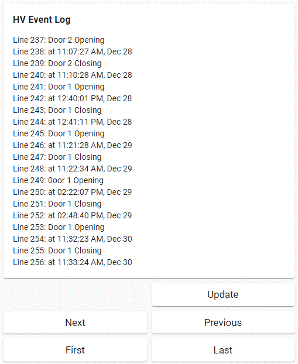

# MQTT Event Log Helper Plug-ins

[Back to Projects Index](/index)

## Overview

MQTT helper plug-in, *MQTT_evlog.hap*,
provides an MQTT interface to the *Netio_evlog.hap* helper plug-in,
which in turn provides an interface to the HomeVision Event Log.

The MQTT helper plug-in was designed with Home Assistant in mind but is useful in other MQTT environments as well.
Control of the Event Log is accomplished via several MQTT messages and results are reported via four MQTT messages. MQTT payloads for HA are max 256 characters, so the 20-line log view is broken into 4 separate MQTT messages.

## Command Messages

```
cmnd/HVLog/update      # refresh to the latest log

cmnd/HVLog/get last
cmnd/HVLog/get first
cmnd/HVLog/get next
cmnd/HVLog/get prev
```
* *update*: refreshes to the latest log entries. This takes some time. While retrieving the log information, progress stat messages are sent about every 10 seconds. The ```stat/HVLog/part1``` response will
contain a percent complete message, while the other three will contain five "blank" lines. 
Once the log retrieval is complete, the last 20 lines of the log will be sent (as if a ```cmnd/HVLog/get last``` command had been sent.
* *last*: return last 20 lines of log. 
* *first*: return first 20 lines of log. 
* *next*: return next 20 lines of log (relative to what was sent previously). 
* *prev*: return previous 20 lines of log (relative to what was sent previously). 

## Response Messages

```
stat/HVLog/part1 {log lines 1-5}
stat/HVLog/part2 {log lines 6-10}
stat/HVLog/part3 {log lines 11-15}
stat/HVLog/part4 {log lines 16-20}
```

Note:
* The payload for each stat message contains five lines of lig information, each ending in a newline.

## Home Assistant Configuration Setup for Log Messages

Create four sensors in configuration.yaml like this:


``` yaml
sensor:
  - platform: mqtt
    unique_id: hv_log1
    name: "HV Log1"
    state_topic: "stat/HVLog/part1"
  - platform: mqtt
    unique_id: hv_log2
    name: "HV Log2"
    state_topic: "stat/HVLog/part2"
  - platform: mqtt
    unique_id: hv_log3
    name: "HV Log3"
    state_topic: "stat/HVLog/part3"
  - platform: mqtt
    unique_id: hv_log4
    name: "HV Log4"
    state_topic: "stat/HVLog/part4"
```


## Home Assistant Setup for Log GUI

Create a GUI. Example like this,
with corresponding yaml. Do this easily with the GUI editor, yaml shown here just for detail:




``` yaml
 - title: Log
    path: log
    visible:
      - user: xxxxxxxxxxxxxxxxxxxxxxx
    badges: []
    cards:
      - type: markdown
        content: >-
          ### HV Event Log

          {{ states('sensor.hv_log1') }}{{ states('sensor.hv_log2') }}{{
          states('sensor.hv_log3') }} {{ states('sensor.hv_log4') }} 
      - type: horizontal-stack
        cards:
          - type: button
            tap_action:
              action: call-service
              service: mqtt.publish
              service_data:
                retain: 0
                payload: ''
                topic: cmnd/HVLog/get
                qos: 0
            entity: sensor.hv_log1
            name: Get Log
            show_icon: false
            hold_action:
              action: none
          - type: button
            tap_action:
              action: call-service
              service: mqtt.publish
              service_data:
                retain: 0
                payload: ''
                topic: cmnd/HVLog/update
                qos: 0
            entity: sensor.hv_log1
            name: Update
            show_icon: false
            hold_action:
              action: none
      - type: horizontal-stack
        cards:
          - type: button
            tap_action:
              action: call-service
              service: mqtt.publish
              service_data:
                retain: 0
                payload: next
                topic: cmnd/HVLog/get
                qos: 0
            entity: sensor.hv_log1
            name: Next
            show_icon: false
            hold_action:
              action: none
          - type: button
            tap_action:
              action: call-service
              service: mqtt.publish
              service_data:
                retain: 0
                payload: prev
                topic: cmnd/HVLog/get
                qos: 0
            entity: sensor.hv_log1
            name: Previous
            show_icon: false
            hold_action:
              action: none
      - type: horizontal-stack
        cards:
          - type: button
            tap_action:
              action: call-service
              service: mqtt.publish
              service_data:
                retain: 0
                payload: first
                topic: cmnd/HVLog/get
                qos: 0
            entity: sensor.hv_log1
            name: First
            show_icon: false
            hold_action:
              action: none
          - type: button
            tap_action:
              action: call-service
              service: mqtt.publish
              service_data:
                retain: 0
                payload: last
                topic: cmnd/HVLog/get
                qos: 0
            entity: sensor.hv_log1
            name: Last
            show_icon: false
            hold_action:
              action: none
```

