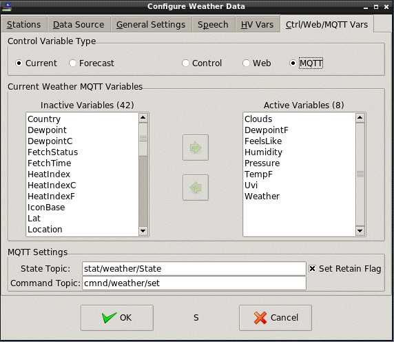
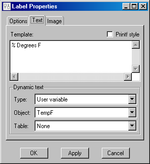
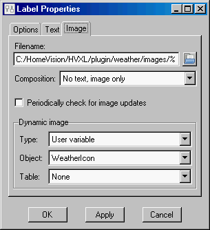
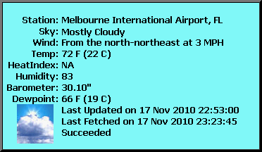

<!-- $Revision: 1.15 $ -->
<!-- $Date: 2021/12/10 18:45:36 $ -->
<html>
<head>
  <title>Weather Plug-in - Using Weather Control Variables</title>
  <link rel="prev" href="webwx">
  <link rel="next" href="forecast">
</head>

<body style="" lang="EN-US" link="blue" vlink="purple">

<b>Using Weather Control Variables</b>

  
The Weather plug-in can pass on to the
Control plug-in, the web and MQTT the <i>current weather</i> info in <b>Table 2</b>, if available in the retrieved weather data.
 

<b>Table 2 - Current Weather Control Variables</b>
 <table border="3" cellpadding="2" cellspacing="0">
  <tbody>
    <tr>
      <th>Control Variable*</th>
      <th>Description</th>
      <th>Example</th>
    </tr>
    <tr>
      <td>Station</td>
      <td>Station ID of reporting station</td>
      <td>KMLB</td>
    </tr>
    <tr>
      <td>SStation1</td>
      <td>Search Station ID</td>
      <td>KMLB</td>
    </tr>
    <tr>
      <td>ZipCode1,5</td>
      <td>Search Zip code</td>
      <td>32901</td>
    </tr>
    <tr>
      <td>Location</td>
      <td>Location of reporting station</td>
      <td>Melbourne International Airport, FL</td>
    </tr>
    <tr>
      <td>Country1</td>
      <td>Country of reporting station</td>
      <td>USA</td>
    </tr>
    <tr>
      <td>CityCode2</td>
      <td>Search City code</td>
      <td>132681</td>
    </tr>
    <tr>
      <td>Lat1</td>
      <td>Search Latitude</td>
      <td>40</td>
    </tr>
    <tr>
      <td>Long1</td>
      <td>Search Longitude</td>
      <td>-75</td>
    </tr>
    <tr>
      <td>ObservationTime</td>
      <td>Time of latest observation</td>
      <td>Last Updated on Aug 3, 1:53 PM7</td>
    </tr>
    <tr>
      <td>ObservationTimerfc822</td>
      <td>Latest observation in ARPA format </td>
      <td>Thu, 3 Aug 2008 13:53:00 -0400 EDT</td>
    </tr>
    <tr>
      <td>Weather</td>
      <td>Current conditions</td>
      <td>Light Rain</td>
    </tr>
    <tr>
      <td>Temp</td>
      <td>Temperature string in F &amp; C</td>
      <td>77 F (25 C)</td>
    </tr>
    <tr>
      <td>TempF</td>
      <td>Temperature in degrees F</td>
      <td>77</td>
    </tr>
    <tr>
      <td>TempC</td>
      <td>Temperature in degrees C</td>
      <td>25</td>
    </tr>
    <tr>
      <td>Humidity</td>
      <td>Relative humidity</td>
      <td>90</td>
    </tr>
    <tr>
      <td>Wind8</td>
      <td>Wind condition string</td>
      <td>From the South at 10 MPH Gusting to 23 MPH</td>
    </tr>
    <tr>
      <td>WindDir</td>
      <td>Wind direction string</td>
      <td>South</td>
    </tr>
    <tr>
      <td>WindDegrees</td>
      <td>Wind direction in degrees</td>
      <td>180</td>
    </tr>
    <tr>
      <td>WindMPH</td>
      <td>Wind speed in MPH</td>
      <td>10</td>
    </tr>
     <tr>
      <td>WindKPH</td>
      <td>Wind speed in KPH</td>
      <td>6</td>
    </tr>
    <tr>
      <td>WindKTS</td>
      <td>Wind speed in Knots</td>
      <td>16</td>
    </tr>
    <tr>
      <td>WindBft</td>
      <td>Wind speed in Beaufort scale</td>
      <td>3</td>
    </tr>
   <tr>
      <td>WindGustMPH</td>
      <td>Wind gusts in MPH</td>
      <td>23</td>
    </tr>
   <tr>
      <td>WindGustKPH</td>
      <td>Wind gusts in KPH</td>
      <td>37</td>
    </tr>
   <tr>
      <td>WindGustKTS</td>
      <td>Wind gusts in Knots</td>
      <td>20</td>
    </tr>
    <tr>
      <td>Pressure</td>
      <td>Barometric pressure string</td>
      <td>29.92" (or: 1013 mb, 760.0 mm)</td>
    </tr>
    <tr>
      <td>PressureIn</td>
      <td>Pressure in inches</td>
      <td>29.92</td>
    </tr>
    <tr>
      <td>PressureMb</td>
      <td>Pressure in Millibars</td>
      <td>1013</td>
    </tr>
    <tr>
      <td>PressureMm</td>
      <td>Pressure in Millimeters</td>
      <td>760.0</td>
    </tr>
    <tr>
      <td>PressureRate2</td>
      <td>Barometric pressure change string</td>
      <td>-</td>
    </tr>
    <tr>
      <td>PressureRateIn2</td>
      <td>Pressure change in inches</td>
      <td>-</td>
    </tr>
    <tr>
      <td>PressureRateMb2</td>
      <td>Pressure change in Millibars</td>
      <td>-</td>
    </tr>
    <tr>
      <td>PressureRateMm2</td>
      <td>Pressure change in Millimeters</td>
      <td>-</td>
    </tr>
    <tr>
      <td>Dewpoint</td>
      <td>Dew point string in F &amp; C</td>
      <td>40F (4 C)</td>
    </tr>
    <tr>
      <td>DewpointF</td>
      <td>Dew point temperature in F</td>
      <td>40</td>
    </tr>
    <tr>
      <td>DewpointC</td>
      <td>Dew point temperature in C</td>
      <td>4</td>
    </tr>
    <tr>
      <td>HeatIndex3</td>
      <td>Heat index string in F &amp; C</td>
      <td>75F (24 C)</td>
    </tr>
    <tr>
      <td>HeatIndexF3</td>
      <td>Heat index temperature in F</td>
      <td>75</td>
    </tr>
    <tr>
      <td>HeatIndexC3</td>
      <td>Heat index temperature in C</td>
      <td>24</td>
    </tr>
    <tr>
      <td>Windchill3</td>
      <td>Wind chill string in F &amp; C</td>
      <td>36F (2 C)</td>
    </tr>
    <tr>
      <td>WindchillF3</td>
      <td>Wind chill temperature in F</td>
      <td>36</td>
    </tr>
    <tr>
      <td>WindchillC3</td>
      <td>Wind chill temperature in C</td>
      <td>2</td>
    </tr>
    <tr>
      <td>FeelsLike4,6</td>
      <td>"Feels like" temp in current units</td>
      <td>75</td>
    </tr>
    <tr>
      <td>Uvi4</td>
      <td>UV index</td>
      <td>3.5</td>
    </tr>
    <tr>
      <td>VisibilityMi</td>
      <td>Visibility in miles</td>
      <td>10</td>
    </tr>
    <tr>
      <td>VisibilityKm</td>
      <td>Visibility in <u>meters</u></td>
      <td>16100</td>
    </tr>
    <tr>
      <td>Clouds4</td>
      <td>Cloud Cover in percent</td>
      <td>50</td>
    </tr>
    <tr>
      <td>WeatherIcon</td>
      <td>File name of current weather icon</td>
      <td>ra.png (NWS), 01d.png (OpenWeather)</td>
    </tr>
    <tr>
      <td>SunRise4</td>
      <td>Today's Sunrise</td>
      <td>07:58:01 AM7</td>
    </tr>
    <tr>
      <td>SunSet4</td>
      <td>Today's Sunset</td>
      <td>06:18:10 PM7</td>
    </tr>
    <tr>
      <td>IconBase</td>
      <td>Web link to icon database</td>
      <td>https://openweathermap.org/img/wn</td>
    </tr>
    <tr>
      <td>FetchTime</td>
      <td>Time of last connection attempt</td>
      <td>Mar 08, 09:18:00 PM7</td>
    </tr>
    <tr>
      <td>FetchStatus</td>
      <td>Status of last connection</td>
      <td>Succeeded or Failed</td>
    </tr>
    <tr>
      <td>SearchType1</td>
      <td>station selection type</td>
      <td>H (for HV User Location)</td>
    </tr>
  </tbody>
</table>

  
* Case sensitive
  
Notes:
 
1 These items are the values to use for station <i>selection</i>, based on the value of <i>SearchType</i>.
The actual station selected may have values different from these.
 
2 <b>No longer supported.</b>
 
3 For NWS, downloaded values are used if available, otherwise calculated.
If OpenWeather, these are always calculated.
 
4 OpenWeather only. 
 
5 Certain zip codes beginning with zeros and with the rest containing only digits in the range 0-7
will be misinterpreted by the Control plug-in as an octal number.
To prevent this, when sent to the control plug-in,
a zip code has 5 spaces and "ZC" appended to it (to force it to be handled as a string instead of a number).
A Control plug-in widget should then use the printf style and  %.5s as the spec.
Since zip codes may not even be available, it might be easier to just use FcLoc.
 
6 Temperatures are expressed according to the <i>Temp Scale</i> setting in the
<i>General Settings</i> tab.
 
7 Time and Date are expressed according to the <i>Time Format</i> setting in the
<i>General Settings</i> tab.
 
8 Winds are expressed according to the <i>Wind Speed</i> setting in the
<i>General Settings</i> tab.

  
The Weather plug-in can pass on to the
Control plug-in, the web and MQTT the <i>forecast weather</i> info in <b>Table 3</b>, if available in the retrieved weather data.
 

<b>
Table 3 - Forecast Control Variables
</b>

 <table border="3" cellpadding="2" cellspacing="0">
  <tbody>
    <tr>
      <th>Control&nbsp;Variable*</th>
      <th>Description</th>
      <th>Example</th>
    </tr>
    <tr>
      <td>FcCity1</td>
      <td>City of reporting station</td>
      <td>Melbourne</td>
    </tr>
    <tr>
      <td>FcState1</td>
      <td>State of reporting station</td>
      <td>FL</td>
    </tr>
    <tr>
      <td>FcZip2</td>
      <td>Search Zip code</td>
      <td>32901&nbsp;&nbsp;&nbsp;&nbsp;&nbsp;ZC</td>
    </tr>
    <tr>
      <td>FcCountry1</td>
      <td>Country of reporting station</td>
      <td>US</td>
    </tr>
    <tr>
      <td>FcLoc1,3</td>
      <td>Location of reporting station</td>
      <td>Melbourne, FL 32901</td>
    </tr>
    <tr>
      <td>FcLat2</td>
      <td>Search Latitude</td>
      <td>40</td>
    </tr>
    <tr>
      <td>FcLong2</td>
      <td>Search Longitude</td>
      <td>-75</td>
    </tr>
    <tr>
      <td>FcDay<i>m</i>, FcDayn<i>m</i></td>
      <td>Forecast day, night for day <i>m</i> (<i>m</i> = 1-7)</td>
      <td>Monday, Monday Night</td>
    </tr>
    <tr>
      <td>FcSc<i>m</i>, FcScn<i>m</i>5</td>
      <td>Short forecast for day, night <i>m</i></td>
      <td>Mostly Cloudy (NWS), 803 (OpenWeather)</td>
    </tr>
    <tr>
      <td>FcLc<i>m</i>, FcLcn<i>m</i>5</td>
      <td>Long forecast for day, night <i>m</i></td>
      <td>Mostly cloudy</td>
    </tr>
    <tr>
      <td>FcHi<i>m</i>6</td>
      <td>High temperature for day <i>m</i></td>
      <td>75</td>
    </tr>
    <tr>
      <td>FcLo<i>m</i>6</td>
      <td>Low temperature for day <i>m</i></td>
      <td>50</td>
    </tr>
    <tr>
      <td>FcTempMorn<i>m</i>6,7</td>
      <td>Morning temperature for day <i>m</i></td>
      <td>60</td>
    </tr>
    <tr>
      <td>FcTempDay<i>m</i>6,7</td>
      <td>Daytime temperature for day <i>m</i></td>
      <td>72</td>
    </tr>
    <tr>
      <td>FcTempEve<i>m</i>6,7</td>
      <td>Evening temperature for day <i>m</i></td>
      <td>65</td>
    </tr>
    <tr>
      <td>FcTempNite<i>m</i>6,7</td>
      <td>Nighttime temperature for day <i>m</i></td>
      <td>50</td>
    </tr>
    <tr>
      <td>FcHumidity<i>m</i>7</td>
      <td>Humidity for day <i>m</i></td>
      <td>50</td>
    </tr>
    <tr>
      <td>FcWind<i>m</i>7,10</td>
      <td>Wind condition string for day <i>m</i></td>
      <td>From the South at 10 MPH Gusting to 23 MPH</td>
    </tr>
    <tr>
      <td>FcWindDir<i>m</i>7</td>
      <td>Wind direction string for day <i>m</i></td>
      <td>From the South</td>
    </tr>
    <tr>
      <td>FcWindDegrees<i>m</i>7</td>
      <td>Wind direction in degrees for day <i>m</i></td>
      <td>190</td>
    </tr>
    <tr>
      <td>FcWindMPH<i>m</i>7</td>
      <td>Wind in MPH for day <i>m</i></td>
      <td>10</td>
    </tr>
    <tr>
      <td>FcWindKPH<i>m</i>7</td>
      <td>Wind in KPH for day <i>m</i></td>
      <td>16</td>
    </tr>
    <tr>
      <td>FcWindKTS<i>m</i>7</td>
      <td>Wind in Knots for day <i>m</i></td>
      <td>7</td>
    </tr>
    <tr>
      <td>FcWindGustMPH<i>m</i>7</td>
      <td>Wind gusts in MPH for day <i>m</i></td>
      <td>23</td>
    </tr>
    <tr>
      <td>FcWindGustKPH<i>m</i>7</td>
      <td>Wind gusts in KPH for day <i>m</i></td>
      <td>37</td>
    </tr>
    <tr>
      <td>FcWindGustKTS<i>m</i>7</td>
      <td>Wind gusts in Knots for day <i>m</i></td>
      <td>20</td>
    </tr>
    <tr>
      <td>FcPressureIn<i>m</i>7</td>
      <td>Pressure in inches for day <i>m</i></td>
      <td>29.92</td>
    </tr>
    <tr>
      <td>FcPressureMb<i>m</i>7</td>
      <td>Pressure in millibars for day <i>m</i></td>
      <td>1013</td>
    </tr>
    <tr>
      <td>FcPressureMm<i>m</i>7</td>
      <td>Pressure in millimeters for day <i>m</i></td>
      <td>760.0</td>
    </tr>
    <tr>
      <td>FcDewpoint<i>m</i>6,7</td>
      <td>Dewpoint for day <i>m</i></td>
      <td>50</td>
    </tr>
    <tr>
      <td>FcFLHi<i>m</i>6,7,8</td>
      <td>High Feels Like temperature for day <i>m</i></td>
      <td>75</td>
    </tr>
    <tr>
      <td>FcFLLo<i>m</i>6,7,8</td>
      <td>Low Feels Like temperature for day <i>m</i></td>
      <td>50</td>
    </tr>
    <tr>
      <td>FcFLMorn<i>m</i>6,7</td>
      <td>Morning Feels Like temperature for day <i>m</i></td>
      <td>60</td>
    </tr>
    <tr>
      <td>FcFLDay<i>m</i>6,7</td>
      <td>Daytime Feels Like temperature for day <i>m</i></td>
      <td>70</td>
    </tr>
    <tr>
      <td>FcFLEve<i>m</i>6,7</td>
      <td>Evening Feels Like temperature for day <i>m</i></td>
      <td>65</td>
    </tr>
    <tr>
      <td>FcFLNight<i>m</i>6,7</td>
      <td>Nighttime Feels Like temperature for day <i>m</i></td>
      <td>50</td>
    </tr>
    <tr>
      <td>FcPop<i>m</i>, FcPopn<i>m</i></td>
      <td>Probability of precip. for day, night <i>m</i></td>
      <td>10</td>
    </tr>
    <tr>
      <td>FcUvi<i>m</i>7</td>
      <td>UV index</td>
      <td>3.5</td>
    </tr>
    <tr>
      <td>FcClouds<i>m</i>7</td>
      <td>Cloud Cover in percent</td>
      <td>23</td>
    </tr>
    <tr>
      <td>FcSunRise<i>m</i>7</td>
      <td>Sunrise for day <i>m</i></td>
      <td>07:58:45 AM9</td>
    </tr>
    <tr>
      <td>FcSunSet<i>m</i>7</td>
      <td>Sunset for day <i>m</i></td>
      <td>06:18:01 PM9</td>
    </tr>
    <tr>
      <td>FcMoonRise<i>m</i>7</td>
      <td>Moon rise for day <i>m</i></td>
      <td>07:58:45 AM9</td>
    </tr>
    <tr>
      <td>FcMoonSet<i>m</i>7</td>
      <td>Moon set for day <i>m</i></td>
      <td>06:18:01 PM9</td>
    </tr>
    <tr>
      <td>FcMoonPhase<i>m</i>7</td>
      <td>Moon Phase for day <i>m</i></td>
      <td>Waxing Gibbous</td>
    </tr>
    <tr>
      <td>FcImg<i>m</i>, FcImgn<i>m</i></td>
      <td>Forecast icon for day, night <i>m</i></td>
      <td>01d.png</td>
    </tr>
    <tr>
      <td>FcTime</td>
      <td>Time of latest observation</td>
      <td>Mon, 10 May 2010 19:00:00 EST9</td>
    </tr>
    <tr>
      <td>FcFetch4</td>
      <td>Time of last connection attempt</td>
      <td>Mon, 10 May 2010 19:05:00 EST9</td>
    </tr>
    <tr>
      <td>FcFetchStatus4</td>
      <td>Status of last connection</td>
      <td>Succeeded or Failed</td>
    </tr>
    <tr>
      <td>FcIconBase4</td>
      <td>Current web link to icons</td>
      <td>http://forecast.weather.gov/images/wtf/</td>
    </tr>
    <tr>
      <td>FcSStation2</td>
      <td>Search Station ID</td>
      <td>KBLM</td>
    </tr>
    <tr>
      <td>FcSearchType2</td>
      <td>Station selection type</td>
      <td>Z (for ZipCode)</td>
    </tr>
  </tbody>
 </table>

  
* Case sensitive
  
Notes:
 
1 FcLoc is a combination of FcCity, FcState, zipcode, and FcCountry.
Depending on search type, not all of these values may be available.
For example, if the forecast is fetched by zip code, country typically is not returned.
If not returned, these variables are set to an empty string,
and FcLoc will consist of the remaining values.
 
2 These items are the values to use for station <i>selection</i>, based on the value of <i>SearchType</i>.
The actual station selected may have values different from these.
 
3 Certain zip codes beginning with zeros and with the rest containing only digits in the range 0-7
will be misinterpreted by the Control plug-in as an octal number.
To prevent this, when sent to the control plug-in,
a zip code has 5 spaces and "ZC" appended to it (to force it to be handled as a string instead of a number).
A Control plug-in widget should then use the printf style and  %.5s as the spec.
Since zip codes may not even be available, it might be easier to just use FcLoc.
 
4 Generated by plug-in.
 
5 OpenWeather sets a weather ID code in the short forecast
and detailed text in the long forecast.
NWS forecasts set both FcLc{n}m and FcSc{n}m to the same "short" text.
In either case, both long and short forecasts are affected by the <i>Line Length</i> setting.
 
6 Temperatures are expressed according to the <i>Temp Scale</i> setting in the
<i>General Settings</i> tab.
 
7 OpenWeather only.
 
8 Generated from highest/lowest of FcFLMorn, FcFLDay, FcFLEve and FcFLNight.
Does not necessarily correspond to the same time period as FcHi, FcLo
 
9 Time and Date are expressed according to the <i>Time Format</i> setting in the
<i>General Settings</i> tab.
 
10 Winds are expressed according to the <i>Wind Speed</i> setting in the
<i>General Settings</i> tab.
  
<b>Configuring Variables</b>
  
Variables can be selected independently for sending to the Control plug-in, web pages via websockets, and to MQTT.
  
There are a large number of potential variables for current and forecast weather.
To avoid having long lists of "user variables" in the Control plug-in,
or sending unneeded information through the websocket or via MQTT,
a subset of variables can be selected for each method.

<ul>
<li>
Open the Configuration dialog: Plugins-&gt;Weather.
</li><li>
Select the <i>Ctrl/Web/MQTT Vars</i> tab.
</li><li>
Select <i>Control</i>, <i>Web</i>, or <i>MQTT</i> in the <i>Variable Type</i> section.
</li><li>
Select <i>Current</i> to see the Inactive and Active lists of current weather variables for that type.
Variables on the Active list will be sent when weather information is fetched.
</li><li>
To move a variable from one list to the other,
double-click it or
select the variable(s) and click on the corresponding arrow.
</li></ul>
  

  
If only the current weather or only the forecast weather is being used,
then ALL of the variables of the other type can be put on the Inactive list.
  
Moving a variable to the Inactive list only prevents that variable
from being sent to the Control plug-in in the future.
It does NOT explicitly remove it from the Control plug-in.
To see newly inactive variable names disappear from the Control plug-in User Variable list,
the Control plug-in may need to be restarted (disabled/enabled via the Plugin Manager, for example).
  
If weather info is being displayed on web pages via the weather websocket,
select which variables are sent over the websocket by selecting <i>Web</i>.
Then select <i>Current</i> and <i>Forecast</i> and move variables to the Active List to have them sent over the weather websocket.
See <a href="wxws">Weather Websockets</a> for set up details.
  
If weather info is being sent via MQTT, further setup is necessary. See <i>MQTT Setup</i> below.
  
<b>
Control Screen Weather Variable Setup
</b>
  
Edit the control screen to add labels, buttons, etc. to display
the values of the weather variables using the Control Variable names in
<b>Table 2</b> and
<b>Table 3</b>.
For example, to display the temperature in degrees
Fahrenheit on a widget - add a new widget, select a style, and then
setup the text tab on the label properties screen similar to this:
  

  
<i>TempF</i>
variable.

If only one weather variable is used in the widget,
then <u>Type</u> can be set to
<i>User Variable</i> and <u>Object</u> to the variable desired.
If used in expressions, variable name should be surrounded by "${}".
Remember that control variable names are case sensitive.
See the Control plug-in Help for more information.

  To display an icon depicting the current
conditions, after adding a new widget and selecting a style, use the
image tab to set up the name of the <i>WeatherIcon</i> control variable.
The weather site updates icons according to both weather conditions
and time of day.
Note: not all icons have day and night versions,
and any particular station may
or may not use the night versions of the icons totally consistent
with real time.
METAR stations do not support night versions.

  The weather icons are dynamically loaded as needed into a weather/images subdirectory of
the plug-in directory. This directory should be used for the path to the icon file.
  
Since most icons are jpeg coded,
the Pixane library needs to be loaded for the Control plug-in to display them properly.
See the "Control Plug-in - Pixane library" help page for more info on loading Pixane.
  

  
Similar icons can be set up for forecast weather using the <i>FcImg</i> variables.
  A more complete example of how various weather variables
can be displayed is shown below.
This display consists of three label widgets:
one with just the names of the data, right-justified,
a second one abutting it on the right, with data values left-justified,
and a third one (like the above example)
with just the weather icon image overlaid on the first one near the bottom.

 

  
<b>MQTT Setup</b>
  
When <i>MQTT</i> is selected in the <i>Variable Type</i> section, The <i>MQTT Settings</i> section is enabled for editing.
  
<i>Sending Weather Information</i>
  
To send weather information via MQTT, define a <i>State Topic</i> to use.
If you wish the state messages to be retained by the MQTT broker, check <i>Set Retain Flag</i>.
  
Current and forecast weather is sent in separate MQTT messages with the same topic.
The payload is in JSON format.
  
Current weather example (formatted for readability):
<pre>
{
    "wx": {
        "location":"Lincroft, New Jersey, US",
        "lat":40.36,
        "long":-74.13,
        "temp":"66 F (19 C)",
        "humidity":72,
        "pressure":"29.88\"",
        "weather":"Clear sky",
        "wind":"From the southwest at 3 MPH",
        "uvi":0,
        "sunrise":"06:50:04 AM",
        "sunset":"06:43:59 PM"
    }
}
</pre>
  
Forecast weather example (formatted for readability):
<pre>
{
    "fc": {
        "loc": "Lincroft, New Jersey, US",
        "time":"28 Sep 2021 03:33:16 PM",
        "day1": {
            "clouds": 76,
            "day": "Tue",
            "flhi": 73,
            "lc": "Moderate rain",
            "pop": 100
        },
        "day2": {
            "clouds": 1,
            "day": "Wed",
            "flhi": 65,
            "lc": "Clear sky",
            "pop": 5
        },
        "day3": {
            "clouds": 17,
            "day": "Thu",
            "flhi": 61,
            "lc": "Few clouds",
            "pop": 0
        }
    }
}
</pre>
Note that in the forecast payload, there may be some general items, like "loc", and then forecast-day specific items. These are grouped under "day1", "day2", etc.. Only days that have Active variables will show up. For example, if you only made Active items for "Day2" and "Day4", there will be no "Day1", "Day3", "Day5", "Day6" or "Day7" in the JSON payload.
  
<i>Controlling Weather Settings</i>
  
To control weather settings via MQTT,
define a "Command Topic" to use.
The payload to use is identical to "WeatherSetVar" and "WeatherSet".
  
Examples, assuming the <i>Command Topic</i> is set to "cmnd/weather/set":
  
Set <i>Location Selection</i> to "HVLatLong":
<pre>
    Topic: cmnd/weather/set
    Payload: "WeatherSet HVLatLong"
</pre>
Set <i>Location Selection</i> to "Lat/Long", with new values:
<pre>
    Topic: cmnd/weather/set
    Payload: "WeatherSet LatLong 40 -74"
</pre>
Set <i>Data Source</i> to "NWS" for both current and forecasts:
<pre>
    Topic: cmnd/weather/set
    Payload: "WeatherSet NWS"
</pre>
Set <i>Data Source</i> to "OpenWeather" for forecasts:
<pre>
    Topic: cmnd/weather/set
    Payload: "WeatherSet forecast OpenWeather"
</pre>
Trigger a Weather fetch in the background:
<pre>
    Topic: cmnd/weather/set
    Payload: "WeatherSetVar"
</pre>
See <a href="wxtriggers">Triggering Weather Fetches</a> for complete details of the WeatherSet and WeatherSetVar syntax.

 
 
<b>Next:</b> 
<a href="forecast">Forecast Examples</a> 
<a href="hvwxvars">HV Controller Weather Variables</a> 
<a href="localwx">Local Weather Data Files</a> 
<a href="speechwx">Speaking Weather Data</a> 
<a href="wxtriggers">Triggering Weather Fetches</a> 
<a href="wxws">Weather Websockets</a> 
<a href="custom">Custom Objects and Websockets</a> 
<a href="netio">Weather Info for NetIO</a> 
<b>See Also:</b> 
<a href="index">Introduction to the Weather Plug-in</a> 
<a href="webwx">Web-Based Weather Data</a> 
<a href="disclaimer">Disclaimer</a> 
</body>
</html>
