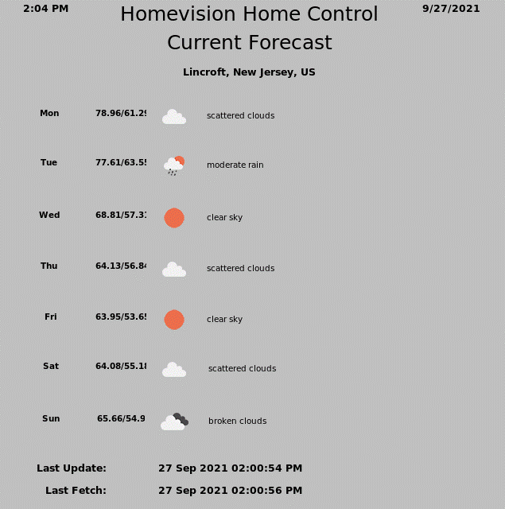
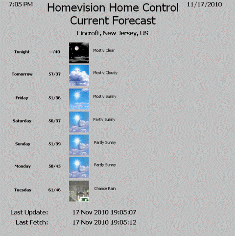
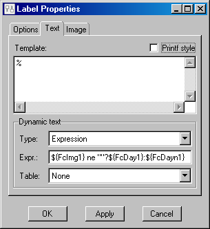
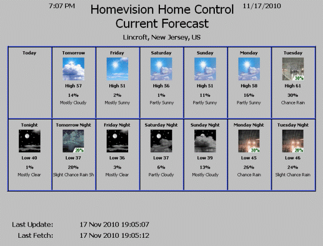

<!DOCTYPE HTML PUBLIC "-//W3C//DTD HTML 4.01 Transitional//EN">
<!-- $Revision: 1.7 $ -->
<!-- $Date: 2021/10/05 02:07:51 $ -->
<html>
<head>
  <title>Weather Plug-in - Forecast Examples</title>
  <link rel="prev" href="controlvars">
  <link rel="next" href="hvwxvars">
</head>

<body style="" lang="EN-US" link="blue" vlink="purple">

<b>Forecast Examples</b>

<b>
Forecast Example 1
</b>

Here is an example of using the forecast data in a Control plug-in screen,
optimized for Weatherbug forecasts. (Layout courtesy of Bob Gardner.)

 

 

Day names, Icons and forecasts use the "day" variables only.

<b>
Forecast Example 2
</b>

Here is an example based on NWS forecasts, using the same screen layout.

 

 

NWS forecasts use both the "day" and "night" portions:
Since the current (i.e., first) day of the forecast may have just a "night" portion
- if the current time is after 6:00 pm -
the first "day" section would be blank, so the "night" portion should be displayed instead.
To accomplish this, create widgets for FcDay1,
FcImg1 and FcLc1 using conditional expressions like the following:
 
 

 
The rest of the forecast can use the "day" variables without using expressions.

<b>
Forecast Example 3
</b>

Here is an example based on NWS forecasts, using separate "day" and "night" sections:

 

 
Forecast data for the first day and the last night of a forecast are often not available.
A technique similar to the above can be used to make sure
all items are NOT displayed if the icon is not available.
 
Not valid for OpenWeather forecasts, as it does not have day/night distinctions.

 <b>Next:</b> 
<a href="hvwxvars">HomeVision Controller Weather Variables</a> 
<a href="localwx">Local Weather Data Files</a> 
<a href="speechwx">Speaking Weather Data</a> 
<a href="wxtriggers">Triggering Weather Fetches</a> 
<a href="wxws">Weather Websockets</a> 
<a href="custom">Custom Objects and Websockets</a> 
<a href="netio">Weather Info for NetIO</a> 
<b>See Also:</b> 
<a href="index">Introduction to the Weather Plug-in</a> 
<a href="webwx">Web-Based Weather Data</a> 
<a href="controlvars">Using Weather Control Variables</a> 
<a href="disclaimer">Disclaimer</a> 
</body>
</html>
