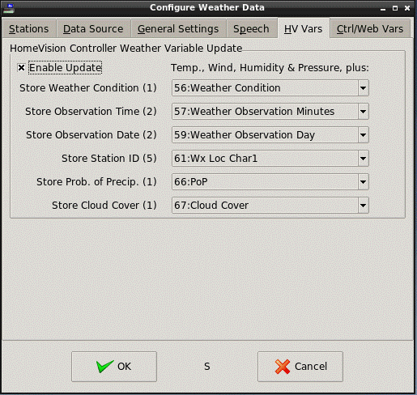

<!DOCTYPE HTML PUBLIC "-//W3C//DTD HTML 4.01 Transitional//EN">
<!-- $Revision: 1.10 $ -->
<!-- $Date: 2021/10/08 22:00:35 $ -->
<html>
<head>
  <title>Weather Plug-in - HomeVision Controller Weather Variables</title>
  <link rel="prev" href="forecast">
  <link rel="next" href="localwx">
</head>

<body style="" lang="EN-US" link="blue" vlink="purple">

<b>HomeVision Controller Weather Variables</b>

HomeVision controller Weather Variables can be updated with weather information.
<b>Table 4</b> shows what weather data is loaded into the Weather Variables.

<b>
Table 4 - HomeVision Controller Weather Variables
</b>

 <table border="3" cellpadding="2" cellspacing="0">
  <tbody>

    <tr>
      <th>Control&nbsp;Variable</th>
      <th>Description</th>
      <th>HomeVision Variable</th>
    </tr>

    <tr>
      <td>TempF/TempC1</td>
      <td>Temperature</td>
      <td>Current Outside Temperature</td>
    </tr>

    <tr>
      <td>Humidity</td>
      <td>Relative Humidity</td>
      <td>Current Outside Relative Humidity</td>
    </tr>

    <tr>
      <td>WindDegrees</td>
      <td>Wind direction degrees</td>
      <td>Wind Direction (digit 1 & digits 2-3)</td>
    </tr>

    <tr>
      <td>Windxxx2</td>
      <td>Wind speed</td>
      <td>Current Wind Speed</td>
    </tr>

    <tr>
      <td>Pressurexx3</td>
      <td>Pressure</td>
      <td>Current Barometric Pressure</td>
    </tr>

    <tr>
      <td>PressureRateMb3</td>
       <td>Pressure Change</td>
     <td>Barometric Pressure Direction</td>
    </tr>

    <tr>
      <td>WeatherIcon4</td>
      <td>Weather Condition</td>
      <td>User-selected HomeVision Controller Variable (1 variable)</td>
    </tr>

    <tr>
      <td>ObservationTime</td>
      <td>Time/date of observation</td>
      <td>User-selected HomeVision Controller Variables (2-4 variables)</td>
    </tr>

    <tr>
      <td>StationID</td>
      <td>5 character StationID.
      If the Station ID is 4 characters, a space character is stored in the fifth location</td>
      <td>User-selected HomeVision Controller Variables (5 variables)</td>
    </tr>

    <tr>
      <td>FcPop<i>m</i>, FcPopn<i>m</i>5</td>
      <td>Selected probability of precipitation, in percent, 0 - 100</td>
      <td>User-selected HomeVision Controller Variable (1 variable)</td>
    </tr>

    <tr>
      <td>Clouds</td>
      <td>Cloud cover, in percent, 0 - 100</td>
      <td>User-selected HomeVision Controller Variable (1 variable)</td>
    </tr>
    
  </tbody>
 </table>

Notes:

1 <i>Current Outside Temperature</i> is set to the temperature in <i>either</i> Fahrenheit or Celsius,
depending on <i>Temp Scale</i> setting in the <i>General Settings</i> tab.

2 <i>Current Wind Speed</i> is set to <i>WindMPH</i>, <i>WindKPH</i>, <i>WindKTS</i>, or <i>WindBeaufort</i>,
depending on <i>Wind Speed</i> setting in the <i>General Settings</i> tab.

3  <i>Current Barometric Pressure</i> is set to inches, millibars or millimeters,
depending on <i>Pressure</i> setting in the <i>General Settings</i> tab.
Due to the way the HomeVision controller stores pressure (in the form of "xx.yy"), values in millibars are actually stored as "decibars",
while values in millimeters are stored in centimeters.
<i>Note: The HomeVision controller's Rising/Falling/Steady condition is not supported and is not set</i>.

4  See <b>Table 5</b> below for weather condition codes.

5  Requires forecasts to be enabled. The rest of these items are current weather.

If a "standard" (the first 6 in <b>Table 4</b>) weather item value falls outside of the range supported by the HomeVision controller,
or is indicated as not available,
the variable is set to a "255", and will be displayed on the Weather TV screen as blanks.

<b>
HomeVision Controller Weather Variable Setup
</b>
<ul>
<li>
Open the Configuration dialog: Plugins-&gt;Weather.
<li>
Select the <i>HV Vars</i> tab and make sure <i>Enable Update</i>
in the HomeVision Controller Weather Variable Update section is checked.
The first 6 items in <b>Table 4</b> will be written to the HomeVision controller
during future fetches.
  

.

 
<li>
To load the remainder of the possible items into the HomeVision controller,
choose a HomeVision controller variable to use for each
item desired.
Leave any item set to "None" to prevent its loading to the HomeVision controller.
<li>
The <i>Weather Condition</i> variable will be loaded with a code corresponding to the current
weather conditions in <b>Table 5</b>.
<li>
Observation time and date are loaded as separate items,
stored in two variables each: minutes, hours for the time, and day, month for the date.
<li>
The plug-in automatically checks to make sure there is room to store the data, and that none of the items overlap.
If there is overflow (past the end of the defined variables) or overlap with another weather item, one or more of the variables will be reset to "None".
Select another variable to avoid the conflict.
<li> While the plug-in prevents overflow and overlap, the specific HV variables to use must be determined with care to make sure
that they are not used by any other unrelated function in the schedule.
Pay particular attention to the multi-variable items (observation time and date, StationID)
to avoid overlapping with other variable usage.
</ul>

<b>
Weather Condition Code
</b>

The <i>Weather Condition</i> code is derived from the current weather icon (NWS) or weather type (OpenWeather) as shown in <b>Table 5</b>.
For a more complete description of the possible weather conditions associated with a particular NWS icon,
see
<a href="http://www.weather.gov/data/current_obs/weather.php">http://www.weather.gov/data/current_obs/weather.php</a>.

OpenWeather icons are mapped into the original 28 conditions as appropriate. Additional codes have been added for OpenWeather conditions that don't quite match the original 28.
<ul>
<li>
Blanks in the OpenWeather columns mean there is no close, equivalent match to NWS conditions.
<li>
Blanks in the NWS Icon column mean that this OpenWeather description has no direct NWS equivalent, but is assigned to a similar code.
<li>
Codes above 28 are new and mean that the OpenWeather description has no direct NWS equivalent, and does not match any of the existing codes.
</ul>

You can find OpenWeather conditions at
<a href="http://openweathermap.org/weather-conditions#Weather-Condition-Codes-2">OpenWeather Icon Descriptions</a>.

Some OpenWeather icons may have a "day" and "night" version. E.g., "01d" and "01n".
 

<b>
Table 5 - Weather Condition Codes
</b>

 <table border="3" cellpadding="2" cellspacing="0">
  <tbody>
   <tr>
      <th>Code</th>
      <th>Weather Conditions</th>
      <th>NWS Icon</th>
      <th colspan="2">OpenWeather</th>
   </tr>
   <tr>
      <th></th>
      <th></th>
      <th></th>
      <th>Code</th>
      <th>Icon</th>
   </tr>
   
    <tr><td align="center">0</td><td>Unknown</td><td align="center">na</td><td></td><td></td></tr>
    <tr><td align="center">1</td><td>Fair/Clear</td><td align="center">skc/nskc</td><td align="center">800</td><td align="center">01d</td></tr>
    <tr><td align="center">2</td><td>A Few Clouds</td><td align="center">few/nfew</td><td align="center">801</td><td align="center">02d</td></tr>
    <tr><td align="center">3</td><td>Partly Cloudy</td><td align="center">sct/nsct</td><td align="center">802</td><td align="center">03d</td></tr>
    <tr><td align="center">4</td><td>Mostly Cloudy</td><td align="center">bkn/nbkn</td><td align="center">803</td><td align="center">04d</td></tr>
    <tr><td align="center">5</td><td>Overcast</td><td align="center">ovc/novc</td><td align="center">804</td><td align="center">04d</td></tr>
    <tr><td align="center">6</td><td>Fog</td><td align="center">fg/nfg</td><td align="center">741</td><td align="center">50d</td></tr>
    <tr><td align="center">7</td><td>Windy/Breezy</td><td align="center">wind/nwind</td><td></td><td></td></tr>
    <tr><td align="center">8</td><td>Rain Showers</td><td align="center">shra</td><td align="center">521</td><td align="center">09d</td></tr>
    <tr><td align="center">9</td><td>Showers in Vicinity</td><td align="center">hi_shwrs/hi_nshwrs</td><td align="center">521</td><td align="center">10d</td></tr>
    <tr><td align="center">9</td><td>Ragged Shower Rain</td><td align="center"></td><td align="center">531</td><td align="center">10d</td></tr>
    <tr><td align="center">10</td><td>Light Rain/Drizzle</td><td align="center">ra1</td><td align="center">500</td><td align="center">10d</td></tr>
    <tr><td align="center">10</td><td>Light Intensity Drizzle</td><td align="center"></td><td align="center">300</td><td align="center">09d</td></tr>
    <tr><td align="center">10</td><td>Drizzle</td><td align="center"></td><td align="center">301</td><td align="center">09d</td></tr>
    <tr><td align="center">10</td><td>Heavy Intensity Drizzle</td><td align="center"></td><td align="center">302</td><td align="center">09d</td></tr>
    <tr><td align="center">10</td><td>Light Intensity Drizzle Rain</td><td align="center"></td><td align="center">310</td><td align="center">09d</td></tr>
    <tr><td align="center">10</td><td>Drizzle Rain</td><td align="center"></td><td align="center">311</td><td align="center">09d</td></tr>
    <tr><td align="center">10</td><td>Heavy Intensity Drizzle Rain</td><td align="center"></td><td align="center">312</td><td align="center">09d</td></tr>
    <tr><td align="center">10</td><td>Shower Rain And Drizzle</td><td align="center"></td><td align="center">313</td><td align="center">09d</td></tr>
    <tr><td align="center">10</td><td>Heavy Shower Rain And Drizzle</td><td align="center"></td><td align="center">314</td><td align="center">09d</td></tr>
    <tr><td align="center">10</td><td>Shower Drizzle</td><td align="center"></td><td align="center">321</td><td align="center">09d</td></tr>
    <tr><td align="center">10</td><td>Light Rain</td><td align="center"></td><td align="center">500</td><td align="center">10d</td></tr>
    <tr> <td align="center">10</td><td>Light Intensity Shower Rain</td><td align="center"></td><td align="center">520</td><td align="center">09d</td></tr>
    <tr><td align="center">11</td><td>Rain/Heavy Rain </td><td align="center">ra/nra</td><td align="center"></td><td align="center"></td></tr>
    <tr><td align="center">11</td><td>Moderate Rain</td><td align="center"></td><td align="center">501</td><td align="center">10d</td></tr>
    <tr><td align="center">11</td><td>Heavy Intensity Rain</td><td align="center"></td><td align="center">502</td><td align="center">10d</td></tr>
    <tr><td align="center">11</td><td>Very Heavy Rain</td><td align="center"></td><td align="center">503</td><td align="center">10d</td></tr>
    <tr><td align="center">11</td><td>Extreme Rain</td><td align="center"></td><td align="center">504</td><td align="center">10d</td></tr>
    <tr><td align="center">11</td><td>Heavy Intensity Shower Rain</td><td align="center"></td><td align="center">522</td><td align="center">09d</td></tr>
    <tr><td align="center">11</td><td>Ragged Shower Rain</td><td align="center"></td><td align="center">531</td><td align="center">09d</td></tr>
    <tr><td align="center">12</td><td>Rain/Ice Pellets</td><td align="center">raip/nraip</td><td></td><td></td></tr>
    <tr><td align="center">13</td><td>Rain/Freezing Rain, Drizzle</td><td align="center">fzrara</td><td align="center"></td><td align="center"></td></tr>
    <tr><td align="center">14</td><td>Freezing Rain</td><td align="center">fzra</td><td align="center">511</td><td align="center">13d</td></tr>
    <tr><td align="center">14</td><td>Sleet</td><td align="center"></td><td align="center">611</td><td align="center">13d</td></tr>
    <tr><td align="center">14</td><td>Light Shower Sleet</td><td align="center"></td><td align="center">612</td><td align="center">13d</td></tr>
    <tr><td align="center">14</td><td>Shower Sleet</td><td align="center"></td><td align="center">613</td><td align="center">13d</td></tr>
    <tr><td align="center">15</td><td>Freezing Rain/Snow </td><td align="center">mix/nmix</td><td></td><td></td></tr>
    <tr><td align="center">16</td><td>Rain/Snow </td><td align="center">rasn/nrasn</td><td align="center">616</td><td align="center">50d</td></tr>
    <tr><td align="center">16</td><td>Light Rain And Snow</td><td align="center"></td><td align="center">615</td><td align="center">13d</td></tr>
    <tr><td align="center">17</td><td>Snow</td><td align="center">sn/nsn</td><td align="center">601</td><td align="center">50d</td></tr>
    <tr><td align="center">17</td><td>Light Snow</td><td align="center"></td><td align="center">600</td><td align="center">13d</td></tr>
    <tr><td align="center">17</td><td>Heavy Snow</td><td align="center"></td><td align="center">602</td><td align="center">13d</td></tr>
    <tr><td align="center">17</td><td>Light Shower Snow</td><td align="center"></td><td align="center">620</td><td align="center">13d</td></tr>
    <tr><td align="center">17</td><td>Shower Snow</td><td align="center"></td><td align="center">621</td><td align="center">13d</td></tr>
    <tr><td align="center">17</td><td>Heavy Shower Snow</td><td align="center"></td><td align="center">622</td><td align="center">13d</td></tr>
    <tr><td align="center">18</td><td>Ice Pellets/Hail</td><td align="center">ip</td><td></td><td></td></tr>
    <tr><td align="center">19</td><td>Thunderstorm in Vicinity</td><td align="center">hi_tsra/hi_ntsra</td><td align="center"></td><td align="center"></td></tr>
    <tr><td align="center">20</td><td>Scattered Thunderstorms</td><td align="center">scttsra/nscttrsa</td><td align="center"></td><td align="center"></td></tr>
    <tr><td align="center">21</td><td>Thunderstorm</td><td align="center">tsra/ntsra</td><td align="center">211</td><td align="center">11d</td></tr>
    <tr><td align="center">21</td><td>Thunderstorm With Light Rain</td><td></td><td align="center">200</td><td align="center">11d</td></tr>
    <tr><td align="center">21</td><td>Thunderstorm With Rain</td><td align="center"></td><td align="center">201</td><td align="center">11d</td></tr>
    <tr><td align="center">21</td><td>Thunderstorm With Heavy Rain</td><td align="center"></td><td align="center">202</td><td align="center">11d</td></tr>
    <tr><td align="center">21</td><td>Light Thunderstorm</td><td align="center"></td><td align="center">210</td><td align="center">11d</td></tr>
    <tr><td align="center">21</td><td>Heavy Thunderstorm</td><td align="center"></td><td align="center">212</td><td align="center">11d</td></tr>
    <tr><td align="center">21</td><td>Ragged Thunderstorm</td><td align="center"></td><td align="center">221</td><td align="center">11d</td></tr>
    <tr><td align="center">21</td><td>Thunderstorm With Light Drizzle</td><td align="center"></td><td align="center">230</td><td align="center">11d</td></tr>
    <tr><td align="center">21</td><td>Thunderstorm With Drizzle</td><td align="center"></td><td align="center">231</td><td align="center">11d</td></tr>
    <tr><td align="center">21</td><td>Thunderstorm With Heavy Drizzle</td><td align="center"></td><td align="center">232</td><td align="center">11d</td></tr>
    <tr><tr><td align="center">22</td><td>Tornado/Water Spout</td><td align="center">nsvrtsra</td><td align="center">781</td><td align="center">50d</td></tr>
    <tr><tr><td align="center">23</td><td>Haze</td><td align="center">mist</td><td align="center">721</td><td align="center">50d</td></tr>
    <tr><td align="center">23</td><td>Mist</td><td align="center"></td><td align="center">701</td><td align="center">50d</td></tr>
    <tr><td align="center">24</td><td>Smoke</td><td align="center">smoke/fu</td><td align="center">711</td><td align="center">50d</td></tr>
    <tr><td align="center">25</td><td>Sand/Dust Whirls</td><td align="center"></td><td align="center">731</td><td align="center">50d</td></tr>
    <tr><td align="center">25</td><td>Sand</td><td align="center"></td><td align="center">751</td><td align="center">50d</td></tr>
    <tr><td align="center">25</td><td>Dust/Sand</td><td align="center">dust</td><td align="center">761</td><td align="center">50d</td></tr>
    <tr><td align="center">25</td><td>Dust</td><td align="center"></td><td align="center">761</td><td align="center">50d</td></tr>
    <tr><td align="center">26</td><td>Blizzard</td><td align="center">blizzard</td><td align="center"></td><td align="center"></td></tr>
    <tr><td align="center">27</td><td>Cold</td><td align="center">cold</td><td></td><td></td></tr>
    <tr><td align="center">28</td><td>Hot</td><td align="center">hot</td><td></td><td></td></tr>
    <tr><td align="center"></td><td></td><td align="center"></td><td></td><td></td></tr>
    <tr><td align="center">30</td><td>Volcanic Ash</td><td align="center"></td><td align="center">762</td><td align="center">50d</td></tr>
    <tr><td align="center">31</td><td>Squalls</td><td align="center"></td><td align="center">771</td><td align="center">50d</td></tr>
</tbody>
</table>

 
 <b>Next:</b> 
<a href="localwx">Local Weather Data Files</a> 
<a href="speechwx">Speaking Weather Data</a> 
<a href="wxtriggers">Triggering Weather Fetches</a> 
<a href="wxws">Weather Websockets</a> 
<a href="custom">Custom Objects and Websockets</a> 
<a href="netio">Weather Info for NetIO</a> 
<b>See Also:</b> 
<a href="index">Introduction to the Weather Plug-in</a> 
<a href="webwx">Web-Based Weather Data</a> 
<a href="controlvars">Using Weather Control Variables</a> 
<a href="forecast">Forecast Examples</a> 
<a href="disclaimer">Disclaimer</a> 
</body>
</html>
