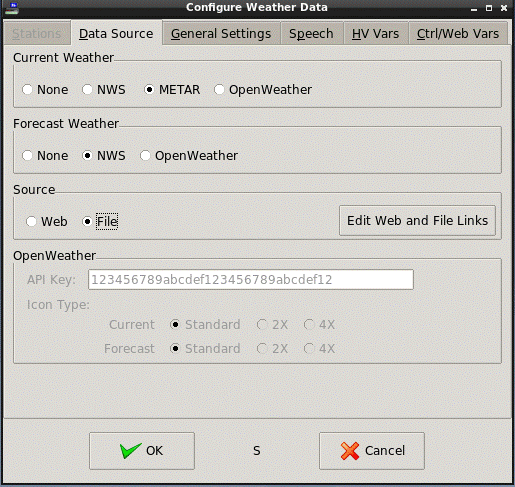

<!-- $Revision: 1.10 $ -->
<!-- $Date: 2021/10/05 02:07:51 $ -->
<html>
<head>
  <title>Weather Plug-in - Local Weather Data Files</title>
  <link rel="prev" href="hvwxvars">
  <link rel="next" href="speechwx">
</head>

<body style="" lang="EN-US" link="blue" vlink="purple">

<b>Local Weather Data Files</b>

The plug-in can also read locally stored files that may have been produced
by another program, as long as the data in the file follows the XML (NWS), METAR, or JSON (OpenWeather) formats.

<b>XML/JSON/METAR Current Weather Formatted Files</b>

<b>Table 6</b> shows the mapping of current weather variables to XML tags or JSON object names.

 

<b>
Table 6 - Current Weather Tags
</b>

 <table border="3" cellpadding="2" cellspacing="0">
  <tbody>
    <tr><th>Control Variable</th><th>NWS XML tag</th><th>OpenWeather JSON objects</th></tr>
    <tr><td>Station</td><td>station_id</td><td>-</td></tr>
    <tr><td>Location</td><td>location</td><td>Gen: lat,lon</td></tr>
    <tr><td>Lat</td><td>latitude</td><td>lat</td></tr>
    <tr><td>Long</td><td>longitude</td><td>lon</td></tr>
    <tr><td>ObservationTime</td><td>observation_time</td><td>Gen.: current:dt</td></tr>
    <tr><td>ObservationTimerfc822</td><td>observation_time_rfc822</td><td>Gen.: current:dt</td></tr>
    <tr><td>Weather</td><td>weather</td><td>current:weather:description</td></tr>
    <tr><td>WeatherId</td><td>-</td><td>current:weather:id</td></tr>
    <tr><td>Temp</td><td>temperature_string</td><td>Gen: current:temp</td></tr>
    <tr><td>TempF</td><td>temp_f</td><td>current:temp1</td></tr>
    <tr><td>TempC</td><td>temp_c</td><td>current:temp1</td></tr>
    <tr><td>Humidity</td><td>relative_humidity</td><td>current:humidity</td></tr>
    <tr><td>Uvi</td><td>-</td><td>current:uvi</td></tr>
    <tr><td>Clouds</td><td>-</td><td>current:clouds</td></tr>

    <tr><td>Wind</td><td>wind_string</td><td>Gen: current:wind_speed, wind_degrees, wind_gust</td></tr>
    <tr><td>WindDir</td><td>wind_dir</td><td>Gen: current:wind_degrees</td></tr>
    <tr><td>WindDegrees</td><td>wind_degrees</td><td>current:wind_degrees</td></tr>
    <tr><td>WindMPH</td><td>wind_mph</td><td>current:wind_speed1</td></tr>
    <tr><td>WindKTS</td><td>wind_kts</td><td>Gen: current:wind_speed</td></tr>
    <tr><td>WindKPH</td><td>Gen: wind_mph</td><td>current:wind_speed1</td></tr>
    <tr><td>WindBft</td><td>Gen: wind_mph</td><td>Gen: current:wind_speed</td></tr>
    <tr><td>WindGustMPH</td><td>wind_gust_mph</td><td>current:wind_gust1</td></tr>
    <tr><td>WindGustKPH</td><td>wind_gust_kph</td><td>current:wind_gust1</td></tr>
    <tr><td>WindGustKTS</td><td>wind_gust_kts</td><td>Gen: current:wind_gust</td></tr>
    <tr><td>Pressure</td><td>pressure_string</td><td>Gen: PressureMb</td></tr>
    <tr><td>PressureIn</td><td>pressure_in</td><td>Gen: PressureMb</td></tr>
    <tr><td>PressureMb</td><td>Gen: PressureIn</td><td>current:pressure</td></tr>
    <tr><td>PressureMm</td><td>Gen: PressureIn</td><td>Gen: PressureMb</td></tr>
    <tr><td>Dewpoint</td><td>dewpoint_string</td><td>Gen: DewpointF, DewpointC</td></tr>
    <tr><td>DewpointF</td><td>dewpoint_f</td><td>current:dew_point1</td></tr>
    <tr><td>DewpointC</td><td>dewpoint_c</td><td>current:dew_point1</td></tr>
    <tr><td>HeatIndex</td><td>heat_index_string</td><td>Gen: HeatIndexF, HeatIndexC</td></tr>
    <tr><td>HeatIndexF</td><td>heat_index_f</td><td>Gen: current:temp, humidity2</td></tr>
    <tr><td>HeatIndexC</td><td>heat_index_c</td><td>Gen: current:temp, humidity2</td></tr>
    <tr><td>Windchill</td><td>windchill_string</td><td>Gen: WindchillF, WindchillC</td></tr>
    <tr><td>WindchillF</td><td>windchill_f</td><td>Gen: current:temp, wind_speed2</td></tr>
    <tr><td>WindchillC</td><td>windchill_c</td><td>Gen: current:temp, wind_speed2</td></tr>
    <tr><td>VisibilityMi</td><td>visibility_mi</td><td>Gen: current:visibility3</td></tr>
    <tr><td>VisibilityKm</td><td>visibility_km</td><td>current:visibility3</td></tr>
    <tr><td>WeatherIcon</td><td>icon_url_name</td><td>current:weather:icon4</td></tr>
    <tr><td>IconBase</td><td>icon_url_base</td><td>Config: "OpenWeather Icons" link</td></tr>
  </tbody>
</table>

Notes: 
 
1 For OpenWeather, the plug-in's "Temp Scale" is used to have temperature and wind-related items reported in either Imperial/English units ("Temp Scale" = "F") or metric units ("Temp Scale" = "C").
The other related items will be generated from them accordingly.
 
2 Heat Index and Wind Chill items are generated from temp, humidity and temp,  wind_speed, respectively.
 
3 VisibilityKm is in meters, max 10000. When converted to miles, max is 10.
 
4 WeatherIcon is set to "{current:weather:icon}.png".

<i>NWS XML Format</i>

NWS current weather tags should be enclosed with the following tags:

<pre>
   &lt;current_observation&gt;
       current weather tags
   &lt;/current_observation&gt;
</pre>

Each current weather tag should be in the form:
<pre>
   &lt;tag&gt;data&lt;/tag&gt;
</pre>
Example:
<pre>
   &lt;current_observation&gt;
       &lt;temp_f&gt;46&lt;/temp_f&gt;
       &lt;temperature_string&gt;46 F (8 C)&lt;/temperature_string&gt;
   &lt;/current_observation&gt;
</pre>

Some weather data is available in both string and numeric formats, as in the examples above.

If used as a substitute for loading a local file into the HomeVision Controller Weather Variables,
tags should be restricted to those found in <a href="hvwxvars"><b>Table 4</b></a> and must use the numeric format.

The suggested naming convention for NWS XML current weather files is {StationID}.xml,
where StationID is the 4 or 5 character station ID. For XML files, this convention is optional.

NWS Forecast files are more complex.
Examples can be found at the appropriate web site.

<i>OpenWeather JSON Format</i>

OpenWeather weather data follows the JSON format and should be in the "current" section or the "daily" section, 
as noted above.
    dict set elems temp F TempF
    dict set elems feels_like F FeelsLike
    dict set elems pressure F PressureMb
    dict set elems humidity F Humidity
    dict set elems dew_point F DewpointF
    dict set elems uvi F Uvi
    dict set elems clouds F Clouds
    dict set elems visibility F VisibilityMi
    dict set elems wind_speed F WindMPH
    dict set elems wind_deg F WindDegrees
    dict set elems wind_gust F WindGustMPH

Example:
<pre>
{
    "lat": 40.36,
    "lon": -74.13,
    "current": {
        "dt": 1632374554,
        "temp": 73.33,
        "feels_like": 74.55,
        "pressure": 1015,
        "humidity": 89,
        "dew_point": 69.89,
        "uvi": 0,
        "clouds": 1,
        "visibility": 10000,
        "wind_speed": 1.01,
        "wind_deg": 240,
        "wind_gust": 5.99,
        "weather": [
            {
                "id": 800,
                "main": "Clear",
                "description": "clear sky",
                "icon": "01n"
            }
        ]
    },
    "daily": [
        {
            "dt": 1632412800,
            "temp": {
                "day": 76.14,
                "min": 69.28,
                "max": 77.36,
                "night": 69.28,
                "eve": 73.58,
                "morn": 73.65
            },
            "feels_like": {
                "day": 77.25,
                "night": 70.27,
                "eve": 74.73,
                "morn": 74.52
            },
            "pressure": 1013,
            "humidity": 81,
            "dew_point": 69.91,
            "wind_speed": 21.14,
            "wind_deg": 153,
            "wind_gust": 33.46,
            "weather": [
                {
                    "id": 501,
                    "main": "Rain",
                    "description": "moderate rain",
                    "icon": "10d"
                }
            ],
            "clouds": 76,
            "pop": 1,
            "rain": 12.26,
            "uvi": 4.06
        },
       ...
    ]
}
</pre>
<i>METAR Formatted Files</i>

Local METAR files should contain exactly ONE line of METAR formatted weather data.
Details of METAR format can be found in
<a href="http://www.ofcm.gov/fmh-1/fmh1.htm">Federal Meteorological Handbook No. 1 - Surface Weather Observations and Reports</a>

The  naming convention for METAR files is {StationID}.met,
where StationID is the 4 character station ID that is also contained in the METAR data within the file.
{StationID} is <i>REQUIRED</i> to match that in the file itself.

<b>Configuring for Local Data</b>
<ul>
<li>
Open the Configuration dialog: Plugins-&gt;Weather.
</li><li>
Select the <i>General Settings</i> tab and make sure <i>Enable Fetch</i> is checked
and a <i>Read Interval</i> is set as appropriate.
</li><li>
Select the <i>Data Source</i> tab
</li><li>
Select <i>File</i> as the <i>Source</i>.
</li><li>
Click on <i>Edit Web and File Links</i>
</li><li>
Enter (or browse for) the desired Current and/or Forecast files.
</li><li>
No Station ID is needed in the Stations Configuration dialog, as it should be contained in the file/filename.
(Note: In fact, the Stations tab is disabled in this mode.)
  

.

</li></ul>
 
 <b>Next:</b> 
<a href="speechwx">Speaking Weather Data</a> 
<a href="wxtriggers">Triggering Weather Fetches</a> 
<a href="wxws">Weather Websockets</a> 
<a href="custom">Custom Objects and Websockets</a> 
<a href="netio">Weather Info for NetIO</a> 
<b>See Also:</b> 
<a href="index">Introduction to the Weather Plug-in</a> 
<a href="webwx">Web-Based Weather Data</a> 
<a href="controlvars">Using Weather Control Variables</a> 
<a href="forecast">Forecast Examples</a> 
<a href="hvwxvars">HomeVision Controller Weather Variables</a> 
<a href="disclaimer">Disclaimer</a> 

