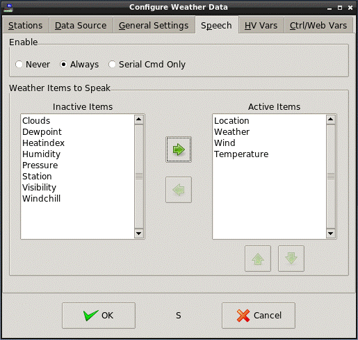

<!DOCTYPE HTML PUBLIC "-//W3C//DTD HTML 4.01 Transitional//EN">
<!-- $Revision: 1.7 $ -->
<!-- $Date: 2021/10/05 02:07:52 $ -->
<html>
<head>
  <title>Weather Plug-in - Speaking Weather Data</title>
  <link rel="prev" href="localwx">
  <link rel="next" href="wxtriggers">
</head>

<body style="" lang="EN-US" link="blue" vlink="purple">

<b>Speaking Weather Data</b>

The plug-in can speak selected weather data using the wintts plug-in.
The wintts plug-in must be enabled and configured separately.

<b>
Speech Setup
</b>
<ul>
<li>
Open the Configuration dialog: Plugins-&gt;Weather.
<li>
Select the <i>Speech</i> tab and make sure <i>Enable</i> is set to <i>Always</i>
or <i>Serial Cmd Only</i>.
When <i>Always</i> is selected,
weather data is spoken every time new data is fetched.
When <i>Serial Cmd Only</i> is selected,
weather data is spoken only if triggered by a serial command.
(See <a href="wxtriggers">Triggering Weather Fetches</a>).  

.

 
<li>
Weather items can be moved from Inactive to Active by double-clicking the items or by selecting them
in the Inactive box and clicking the right arrow button.
Weather items can be moved from Active to Inactive by double-clicking the items or selecting them
in the Active box and clicking the left arrow button.
<li>
Items in the Active box can be rearranged by selecting them and clicking
the up and down arrow buttons.
Weather data will be spoken in the order items are listed in the Active box.
</ul>

Spoken Weather data will use the same units of measure as set in the
<i>General Settings</i> tab.

Note that there are certain conditions by which a particular weather item
may NOT be spoken.
<ul>
<li>
The particular weather item simply wasn't reported by the weather site
(or contained in the source file).
This can happen to just about any item.
<li>
The item is not valid for the current conditions.
For example, heat index is only valid if the temp is greater than 80 F
and the humidity is greater than 40%.
Wind chill is only valid if the temp is less than 41 F
and the wind speed is greater than 3 MPH.
So if you have BOTH heat index and wind chill
selected, at best, only one will be spoken, and often neither will
(like on a calm, dry day in the 70's).
</ul>

 <b>Next:</b> 
<a href="wxtriggers">Triggering Weather Fetches</a> 
<a href="wxws">Weather Websockets</a> 
<a href="custom">Custom Objects and Websockets</a> 
<a href="netio">Weather Info for NetIO</a> 
<b>See Also:</b> 
<a href="index">Introduction to the Weather Plug-in</a> 
<a href="webwx">Web-Based Weather Data</a> 
<a href="controlvars">Using Weather Control Variables</a> 
<a href="forecast">Forecast Examples</a> 
<a href="hvwxvars">HomeVision Controller Weather Variables</a> 
<a href="localwx">Local Weather Data Files</a> 
<a href="disclaimer">Disclaimer</a> 
</body>
</html>
