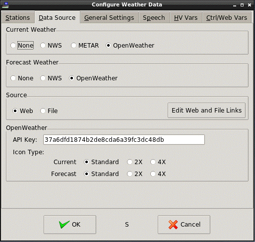
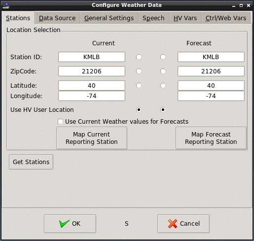
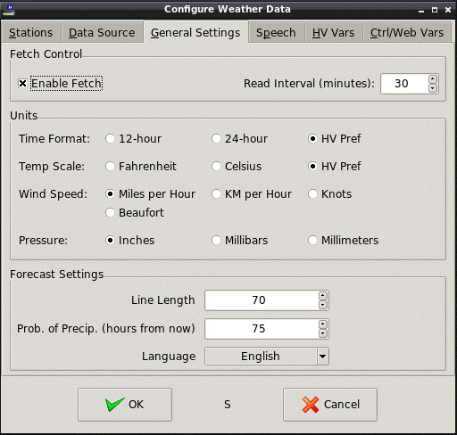

<!-- $Revision: 1.19 $ -->
<!-- $Date: 2021/10/08 22:00:34 $ -->
<html>
<head>
  <title>Weather Plug-in - Web-Based Weather Data</title>
  <link rel="prev" href="index">
  <link rel="next" href="controlvars">
</head>

<body style="" lang="EN-US" link="blue" vlink="purple">

<b>Web-Based Weather Data</b>
 
 
This mode gets weather data from a web site operated by the
U.S. National Weather Service (NWS) or OpenWeather.org.
The NWS supplies XML-formatted or METAR-formatted weather data.
NWS XML data is available for locations in the U.S. and some of its possessions.
METAR data is available for locations worldwide.
OpenWeather.org provides JSON formatted weather data and is available for locations worldwide.
 
 
<b>Configuring for Web-based Data</b>
<ul>
<li>
Open the Configuration dialog: Plugins-&gt;Weather.
</li><li>
Select the <i>General Settings</i> tab and make sure <i>Fetch Enable</i> is checked.
</li><li>
Set the <i>Read Interval</i>.
<i>Read Interval</i> determines how often the weather
plug-in will fetch the weather data from the appropriate web site.
The default <i>Read Interval</i> is 15 minutes but it can be
anything between 0 and 9999.
For convenience, the arrows in the entry field increment or decrement the current value by 5 minutes.
Setting <i>Read Interval</i> to 0 <u>disables</u> periodic fetching of weather data.
(There are other ways to trigger weather data fetches.
See <a href="wxtriggers">Triggering Weather Fetches</a>.)
</li><li>
Select the <i>Data Source</i> tab.
</li><li>
Select the <I>Current Weather</I> type as <i>NWS</i>, <i>METAR</i> or <i>OpenWeather</i>.
If no current weather is desired. select <I>None</I>.
</li><li>
Select the <I>Forecast Weather</I> type as <i>NWS</i> or <i>OpenWeather</i>.
If no forecast weather is desired, select <I>None</I>.
</li><li>
Select <i>Web</i> as the <i>Source</i>.
</li><li>
If OpenWeather is selected in either <I>Current Weather</I> or <I>Forecast Weather</I>,
an OpenWeather API Key must be entered. You can get free keys at
<a href="http://openweathermap.org/full-price#current">OpenWeather.org</a>.
You must select a package (most likely you would want select: Free > Get API Key), and follow instructions to get your key.
Copy the API Key and into the Weather plug-in Configuration Data Source screen.
</li><li>
OpenWeather icon size selection allows for three different size icons: 
"standard" (50x50), 2X (100x100), or 4X (200x200).
Select the one(s) you want.
</li><li>
The <i>Edit Web and File Links</i> button brings up a screen that allows the standard Web links to be changed.
The <i>METAR</i>, <i>NWS</i> and <i>OpenWeather</i> fields contain the base URLs/ftp addresses
for the Web data.
Under normal circumstances, these items do not need to be changed;
the plug-in comes with an appropriate set of defaults.
It's best reserved for making corrections if
the source suppliers actually change their site addresses.
 
  
You can restore "default" links by clicking "Restore to Defaults".
This is most useful if you upgrade to a plug-in version that has newer, up-to-date links and you want to update to them. Without a "Restore" feature, if you had previous versions of the plug-in, the links from that will be retained and not automatically updated by newer links in subsequent versions.<b><i>Use with Caution!</i></b>
 
 
If <i>Source</i> is set to <i>File</i>, then the files for current and forecast data can be set here.
 
 
 

.

 
 
</li><li>
Select the <i>Stations</i> tab.
This screen shows the possible ways of setting the location for which
current and forecast weather is desired.
Current and Forecast locations can be set separately.
Specific location types are enabled depending on what was selected in the <i>Data Source</i> tab.
Actions taken for each possible selection are show in <b>Table 1</b>.
 
 

<b>
Table 1 - Data Source/Station Selection
</b>

 <table>
  <tbody>

    <tr>
      <th></th>
      <th colspan="2">NWS/METAR1</th>
      <th colspan="2">OpenWeather</th>
   </tr>
    <tr>
      <th>Station Setting</th>
      <th>Current</th>
      <th>Forecast</th>
      <th>Current</th>
      <th>Forecast</th>
   </tr>

    <tr>
      <td>StationID</td>
      <td>Use StationID</td>
      <td>Use station's Lat/Long</td>
      <td>Use station's Lat/Long2</td>
      <td>Use station's Lat/Long2</td>
    </tr>

    <tr>
      <td>ZipCode</td>
      <td>Use station closest to Lat/Long4 of ZipCode3</td>
      <td>Use ZipCode</td>
      <td>Lat/long of ZipCode3</td>
      <td>Lat/long of ZipCode3</td>
    </tr>

    <tr>
      <td>Lat/Long</td>
      <td>Use station closest to Lat/Long4</td>
      <td>Use Lat/Long</td>
      <td>Use Lat/Long</td>
      <td>Use Lat/Long</td>
    </tr>

    <tr>
      <td>HV User Location</td>
      <td>Use station closest to HV User Lat/Long4</td>
      <td>Use HV User Lat/Long</td>
      <td>Use HV User Lat/Long</td>
      <td>Use HV User Lat/Long</td>
    </tr>

  </tbody>
 </table>

 
Notes:
 
 
1 METAR only supports current weather.
 
2 StationID cannot be used directly for NWS forecasts or either current or forecasts for OpenWeather,
so the StationID's latitude and longitude is used instead.
To get a StationID's latitude and longitude, Station Data must be downloaded via the
<i>Retrieve Stations</i> button (see below).
If a StationID has no known latitude and longitude, no weather data is retrieved.
 
3 Uses Geonames.org to look up a ZipCode, then uses its latitude/longitude.
If none are found, uses HV location latitude/longitude.
 
4 Latitude and Longitude values are used to find the closest StationID found in Station Data.
A "square" of approximately 400 mi/650 km per side is searched for the nearest station.
If no stations are found, the fetch will fail.
 
 
<i>About Station Selection</i>
 
 
As can be seen, there are multiple choices for where to get weather data,
and how to specify the locations to be reported.
 
 
OpenWeather uses Latitude and Longitude to determine weather.
If StationID or ZipCode are selected, the plug-in attempts to find required Latitude and Longitude.
If it can't, no weather if fetched.
 
 
The StationID can be manually entered into the StationID field
if it is already known.
Station IDs must be 4 or 5 alphanumeric characters in length.
Most land-based station IDs are 4 characters.
 
 

.

 
 
Optionally, the plug-in can get a list of available
<a href="http://w1.weather.gov/xml/current_obs">U.S. StationIDs</a>,
organized by state/possession, by clicking on <i>Get Stations</i>.
and then click on <i>Retrieve Stations</i> to initially download station information.
Choose a state,
and click on the desired station in the list.
To populate the StationID fields in the <i>Stations</i> tab,
click the appropriate button at the bottom of the screen.
 
 
Note: <i>Retrieve Stations</i> only produces a list of U.S.-based stations.
Most of these stations directly support both NWS and METAR current weather reports
and can support current and forecast OpenWeather weather reports if latitude and longitude are reported for the desired station.
Non-U.S. StationIDs (METAR only) must be entered manually.
Use the
<a href="http://www.aviationweather.gov/metar">NOAA/NWS Aviation Weather Service Weather Station map</a>
to find the station you want.
  
StationIDs do not need to be in the current station list; however, those combinations in <b>Table 1</b>
that depend on a station's latitude/longitude information will not work.
 
 
After the list of stations is fetched from the web once,
a local cache file is kept for future use.
If this file exists when the Weather plug-in starts,
it will read station info from it
faster than downloading it again from the web.
The station data does not need to be updated from the web more than once
(except in the rare case that a new station is added that you want to use.)
 
 
<i><b>Note: The station web file contains a very large number of stations,
many of which do not provide any useful weather information.
Depending on the Internet connection and PC speed,
the download and processing of the station list may take a long time.
</b></i>
To decrease the size of the saved cache file (and decrease the time it takes to load it again at plug-in startup),
check the "Retrieve Short List" checkbox. This filters out stations with other than 4 character IDs (unless the station name contains "air")
and any with IDs that consist of the state abbreviation followed by numerals.
 
 
Even with this filter, some stations will still be useless (i.e., not presenting any weather info).
You can "hide" useless stations by right-clicking on them and selecting "Hide".
You can "unhide" them in a similar way.
If "Show Hidden Stations" is NOT checked, any hidden station will not show up on the list,
but will remain in the cache file.
If checked, hidden stations will show in the list, although they will still have the "hidden" property.
You can also "delete" stations from the right-click menu.
As with hidden stations, deleted stations will show in the list or not,
depending on the "Show Hidden Stations" setting.
Stations marked for deletion can be changed back to hidden or unhidden until
"OK" is clicked, at which point they are permanently deleted from the station list and the station cache file.
 
 
If you use NWS and select latitude/longitude or HV location as station selectors,
the plug-in will search the the station list for the closest station.
Hidden stations are ignored during the search.
</li><li>
Your selected station and the stations actually used for current and forecast weather
can now be mapped using Google Maps (or an alternative mapping site as long as it accepts location info in the form of latitude and longitude in its URL).
Once you have fetched weather info at least once,
clicking on "Map Current Reporting Station" or "Map Forecast Reporting Station"
will launch your default browser
using the reporting latitude and longitude in a maps query.
There is a "Map Selected Station" in the "Get Stations" configuration screen
That will map the selected station there.
 
 
You can modify the mapping URL by going to <i>Data Source</i> and clicking on
<i>Edit Web and File Links</i>.
Within the Map URL, create your URL and use &lt;lat&gt; and &lt;lon&gt; as placeholders for latitude and longitude.
Actual latitude and longitude values will replace the placeholders before the browser is launched.
</li><li>
When checked, <i>Use Current Weather values for Forecasts</i> "copies" values in the current entries to the forecast entries.
While checking <i>Use Current Weather values for Forecasts</i> disables the forecast entry boxes,
the forecast radio buttons are still enabled to allow independent forecast selection when NWS is also selected.

Typically, when OpenWeather data is fetched, it returns both the current weather and the forecast in one shot. This means that if the station selection is the same for both current and forecast only one fetch need be done. To achieve this, you should 1) Check 
<i>Use Current Weather values for Forecasts</i>, and 2) Set Current and Forecast station selection radio buttons to the same type.
</li><li>
Select the <i>General Settings</i> tab.
</li><li>
In the <i>Units</i> section, select the desired time format, temperature scale,
wind speed and pressure units.
If "HV Pref" for Time Format or Temp Scale is chosen, the Weather plug-in uses
the corresponding setting in HomeVisionXL's Preferences.
</li>
 

.
  
 
<li>
In the <i>Forecast Settings</i> section, <i>Line Length</i> determines where to "wrap" long forecasts.
Long forecasts often take a lot of characters. You can adjust where the forecast does line breaks by setting the Line Length.
This should be set to match the width of any control screen widget used to display forecast text.
For convenience, the arrows in the entry field increment or decrement the current value by 10 characters.
A length of 70 typically fits forecasts of up to three lines.
</li><li>
Probability of precipitation (POP) for NWS is available for
(up to) 14 12-hour periods over the seven day forecast,
each day having one "day" period and one "night" period.
Day periods start at 06:00
and night periods start at 18:00.
OpenWeather has POP for up to 7 daily periods (no day/night).
See <a href="controlvars">Using Weather Control Variables</a> for details of POP Control Variables.
 
 
To store a POP value to the HomeVision Controller,
in the <i>Forecast Settings</i> section set <i>Prop. of Precip.</i>
to the number of hours in the future for which the POP is desired.
For convenience, the arrows in the entry field increment or decrement the current value by 6 hours.
This value is added to the latest fetch time to determine which 12-hour (or 24 for OpenWeather) period to get the POP from.
The number of hours can be from 1 to 168.
However, due to the way real time "slides" through the first (and sometimes the second) time period,
values over 144 hours may point to POP periods that are invalid, resulting in a "255" being loaded into the HomeVision Controller.
This shouldn't be a real problem, since POP predictions that far in advance are unreliable anyway.
Note also, for the POP to be loaded into the HomeVision Controller, a controller variable must be defined in the
<i>HV Vars</i> tab as well (see <a href="hvwxvars">HomeVision Controller Weather Variables</a>).
</li>
<li>
Press <i>OK</i> to save changes.
 
 
Once the plug-in is configured,
current settings are saved even if HomeVisionXL is exited.
 
 
Pressing <i>Cancel</i>
will discard all changes made during the current configuration session,
except for the stations list, if downloaded.</li>
</ul>
 
 
<b>Next:</b> 
<a href="controlvars">Using Weather Control Variables</a> 
<a href="forecast">Forecast Examples</a> 
<a href="hvwxvars">HomeVision Controller Weather Variables</a> 
<a href="localwx">Local Weather Data Files</a> 
<a href="speechwx">Speaking Weather Data</a> 
<a href="wxtriggers">Triggering Weather Fetches</a> 
<a href="wxws">Weather Websockets</a> 
<a href="custom">Custom Objects and Websockets</a> 
<a href="netio">Weather Info for NetIO</a> 
<a href="wxmqtt">Weather with MQTT</a> 
<b>See Also:</b> 
<a href="index">Introduction to the Weather Plug-in</a> 
<a href="disclaimer">Disclaimer</a> 

